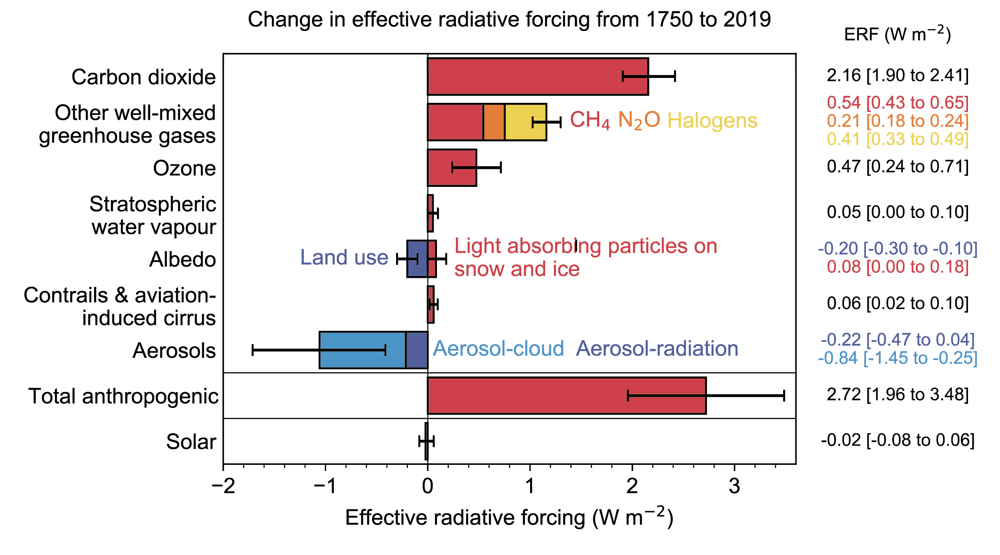
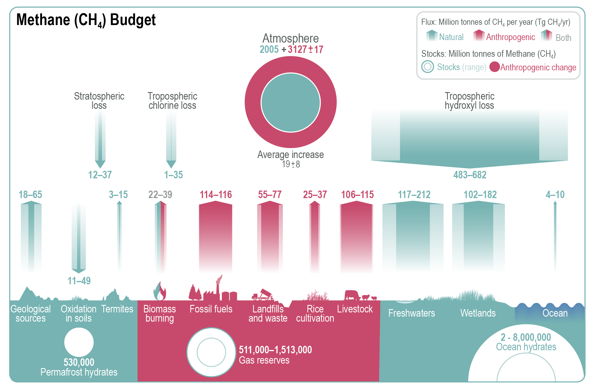
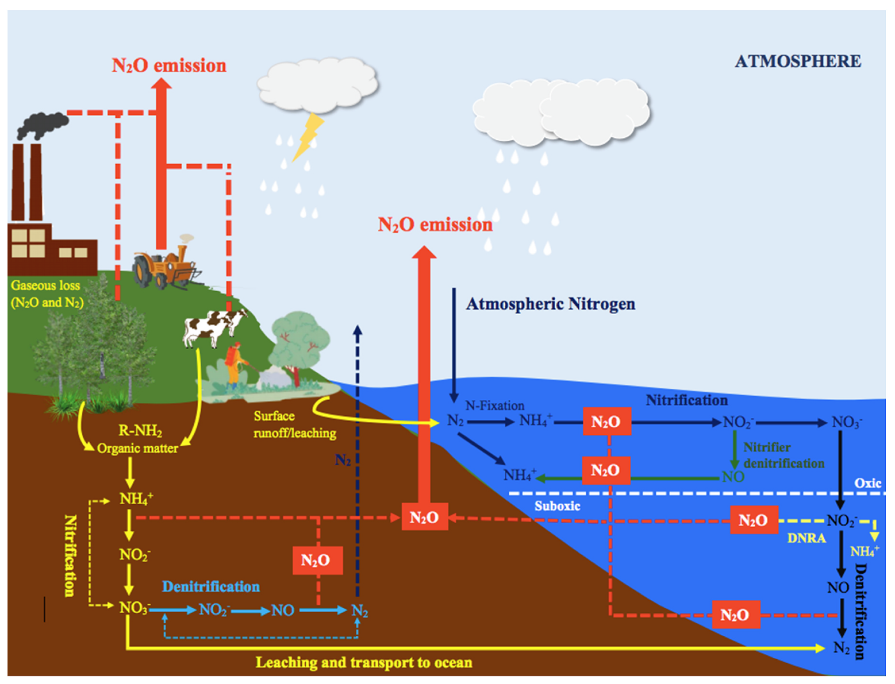
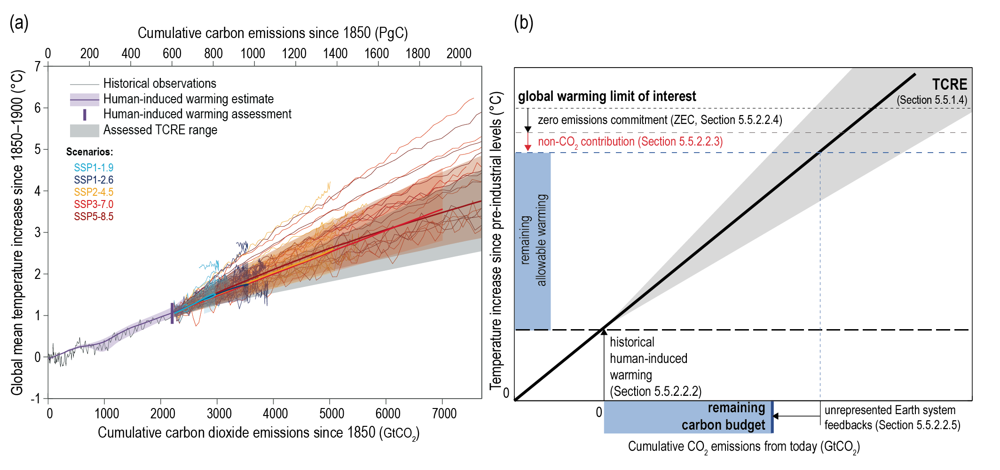

Terrestrial greenhouse gas exchange {#sec-ghg}

Guest Authors: Fabrice Lacroix, Ting Tan,  Shiyuan Feng

## Greenhouse gases and the Earth's Energy Budget
Greenhouse gases are gases that absorb longwave radiation while letting shortwave radiation bypass, thus trapping heat within the atmosphere. The rise in concentration of such gases, such as CO~2~, CH~4~ and N~2~O, since the preindustrial time period has caused an energy surplus in the atmosphere and substantial warming of the climate (fig-radiative-forcing). Understanding their sources and sinks, and how these are changing with climate and other anthropogenic change, is key to understand current and project future warming of the planet due to human activities.

```{r echo=FALSE}
#| label: fig-radiative-forcing
#| fig-cap: "Change in radiative forcing from 1750 to 2019 of greenhouse gases (CO2, non-CO2 greenhouse gases - broken down into contributions of N~2~O, CH~4~) versus other known forcing agents in the Earth system. Solid bars represent best estimates, and very likely (5–95%) ranges are given by error bars. From @IPCC_2021_WGI_Ch_7"
#| out-width: 100%

```

## Terrestrial sinks and sources of atmospheric greenhouse gases

While the source of anthropogenic CO~2~ to the atmosphere is dominated by the direct burning of fossil fuel, terrestrial emission pathways from natural systems as well as land management have also emerged as sources of CO~2~, CH~4~ and N~2~O to the atmosphere. Land use change is thought to be an important contributor of CO~2~ to the atmosphere since the preindustrial time period (@friedlingstein25essd, see also \@ref(sec-globalcarbonbudget)). Thawing of permafrost, disturbances such as fire, as well as drainage of wetlands can cause substantial enhancements in CO~2~ emissions to the atmosphere. Overall however, unmanaged and covered land areas are still an increasing sink globally of CO~2~ owing largely to the effect of CO~2~ fertilization.

Terrestrial systems can be important net sources of the non-CO~2~ greenhouse gases CH~4~ and N~2~O, which are amongst the most potent radiative forcing agents (@fig-radiative-forcing). Although atmospheric concentrations of CH~4~ and N~2~O are two to three orders of magnitude lower than concentrations of CO~2~ (factor 100-1000), their contribution to anthropogenic climate change, measured by their effective radiative forcing, is disproportionately larger due to the high *global warming potential* of these greenhouse gases (@sec-n2och4lifetime).  Amongst them, methane (CH~4~) has the highest effective radiative forcing (ERF) since 1700 with 0.54 [0.43-0.65] W m^-2^ - comparable in magnitude to the ERF of halogens and ozone. Nitrous oxide (N~2~O) also has a sizable contribution to anthropogenic climate change with an ERF of 0.21 [0.18-0.24] W m^-2^, amounting to roughly 10% of the ERF of CO~2~, which is 2.16 [1.90-2.41] W m^-2^. Note however that both CH~4~ and N~2~O are emitted from a large number of natural and anthropogenic sources. For this reason, it is not straight-forward to separate them because of the use and transformation of natural ecosystems for human activities. 

## Terrestrial CO~2~ Budget

As shown in Chapter 4 (Global Carbon Budget, \@ref(sec-globalcarbonbudget)), the terrestrial sphere plays an important role in the global CO~2~ budget: The terrestrial Earth system component accounts for part of global emissions from land use change, but it has taken up around 21% of total emissions, absorbing atmospheric CO~2~. This sink is thought to be driven by the CO~2~-fertilization effect on the vegetation growth and carbon uptake based on model simulations (@friedlingstein25essd). This effect of CO~2~ fertilization may explain a large part of observed greening trends around the globe, and has been demonstrated in elevated CO~2~ experiments (@walker2015gbc), as well as tree ring records (@hubau2020nat). Climate-driven effects in turn act towards reducing this sink through the enhancement of soil emissions and decreased plant growth in the tropics (@friedlingstein2025). More details on the global carbon budget and spatial CO~2~ patterns can be found in its dedicated Chapter (sec{}).


## Global Methane Budget (CH~4~) and its Terrestrial sources

Generally, methane is produced through fossil fuel burning, wet soil or freshwater, as well as agricultural emissions. Methane emissions arise from both natural processes (dark cyan in @fig-methane), contributing to its atmospheric concentrations, but concentrations have been increasing due to enhanced emissions from human activities, as well as through human-caused warming. The atmosphere is a sink of methane primarily through tropospheric hydroxyl loss, and other minor tropospheric and stratospheric consumption processes (dark red in @fig-methane). A certain amount of methane is also sequestered through its oxydation in soils.

The largest natural terrestrial sources of methane include emissions from wetlands, freshwater systems, and geological processes. For the former two, these sources of methane, which arise in conditions where oxygen levels are very low, are thereby the residual of production of methane within the ecosystem, and its oxydation within the soil or water column. As depicted in @fig-methane, wetlands contribute 102-182 Tg CH~4~ yr^-1^, mainly through microbial activity in anaerobic conditions. The emissions are particularly high in tropical wetlands, where red and warm conditions provide ideal production areas. There are also substantial emissions arising from wet soils and wetlands in higher latitudes. Further global emissions of methane arise from freshwater systems, particularly lakes with sediments rich in organic matter, which emit 117-212 Tg CH~4~ yr^-1^ via ebullition (bubble formation) and diffusion through the water column. Low latitude areas are also dominant for their emissions, while high latitude freshwaters can also account for globally-significant sources. Terrestrial geological processes furthermore emit 18–65 Tg CH~4~ annually from the Earth's crust through faults and fractured rocks and seeps. The ocean contributes a smaller share, with only 4–10 Tg CH~4~ yr^-1^, through biogenic, geological and hydrate emissions from coastal and open ocean, while termites, an insect infraorder, release around 9 Tg CH~4~ yr^-1^.


Changes in soil conditions (warming, soil moisture change), in freshwater temperatures, as well as warming of ocean waters and changes in circulation can affect methane production and oxygation, although these changes remain strongly uncertain at the global scale. Particularly, the thawing of permafrost and changes in wetland areas may be causing changes in CH~4~ emissions. The permafrost release of CH~4~ may cause a positive climate feedback with future warming (see \@ref(sec-feedbacks). 

```{r echo=FALSE}
#| label: fig-methane
#| fig-cap: "Global methane (CH~4~) budget (2008–2017). The atmospheric stock is calculated from mean CH~4~ concentration, multiplying a factor of 2.75 ± 0.015 Tg ppb^–1^, which accounts for the uncertainties in global mean CH~4~. Figure and caption taken from @canadell21ipcc."
#| out-width: 100%

```

Direct anthropogenic sources of methane primarily arise from fossil fuel extraction and processing, livestock, waste management, and rice cultivation. Fossil fuel extraction is estimated to contribute 114–116 Tg CH~4~ yr^-1^, with significant emissions arising from countries such as China, the United States, and Russia, which are the leading producers of coal, oil, and gas, globally. Livestock, particularly ruminants, are the largest source linked to agricultural activities, emitting 106–115 Tg CH~4~ yr^-1^ through enteric fermentation and manure management in anaerobic conditions. Similarly, anaerobic decomposition occurs in landfills and during organic waste treatment, as well as in flooded rice paddies (25-37 Tg CH~4~ yr^-1^). Additionally, methane is released during incomplete combustion of organic material in biomass burning. Biomass burning contributes 22-39 Tg CH~4~ yr^-1^, with emissions coming from burning crop residues, savannah fires, forest fires, and stoves. However, distinguishing between natural and human-caused fires is complicated by a variety of factors, including weather conditions, vegetation types and land management practices, which are driven by the interplay of natural and human activities.

## Global nitrous oxide (N~2~O) budget and terrestrial sources

Current N~2~O sources to the atmosphere consist of natural terrestrial and oceanic sources, as well as a number of anthropogenic sources occuring from the burning of fossil fuel, production in sewage water, as well as in agricultural processes. Due to these anthropogenic sources, atmospheric concentrations of N~2~O have also experienced a substantial rise since the start of the industrial time period (@fig). The loss of N2O in the Earth system occurs through stratospheric oxydation. 

Global natural sources of nitrous oxide (N~2~O) include soils covered by unmanaged vegetation, oxygen-deprived zones of the open ocean, as well as smaller contributions from inland water bodies and atmospheric chemistry (@fig-nitrousoxide-sources). Terrestrial ecosystems produce N~2~O through microbial nitrification and incomplete denitrification, which both are redox processes occuring in soils. Nitrification, which uses NO~3~^-^ as a substrate, occurs under oxic conditions, whereas N~2~O emissions occur under incomplete denitrification, which uses NO~3~^-^ as an oxidant, under largely anoxic conditions. Natural sources of N~2~O thereby add up to 4.9-6.5 TgN yr^-1^ through microbial nitrification and denitrification, as shown in @fig-nitrousoxidetransformations.

Other than terrestrial sources, fossil fuel burning produces a source of 2.5-4.3 TgN yr^-1 to the atmosphere, while the open ocean emits 2.5-4.3 TgN yr^-1^, largely through nitrification in productive but oxygen-rich waters, and denitrification in subsurfacce oxygen minimum zones, as well as in coastal sediments.

```{r echo=FALSE}
#| label: fig-nitrousoxide-sources
#| fig-cap: "Global nitrous oxide (N~2~O) budget (2007–2016). The atmospheric stock is calculated from mean N~2~O concentration, multiplying a factor of 4.79 ± 0.05 Tg ppb^–1^. Pool sizes for the other reservoirs are largely unknown. Figure and caption taken from @canadell21ipcc."
#| out-width: 100%
knitr::include_graphics("https://www.ipcc.ch/report/ar6/wg1/downloads/figures/IPCC_AR6_WGI_Figure_5_17.png")
```

Of the anthropogenic N~2~O emissions, agriculture is the most important source, contributing 2.5–5.8 TgN yr^-1^ due to the extensive use of synthetic fertilizers and manure on croplands and pastures, as well as from manure management and aquaculture. Fertilizers and manure enrich the soil nutrition for plants but also increase N~2~O emissions from soil inorganic nitrogen that is not absorbed by plants. A further -0.6-1.1 TgN yr^-1^ could be added to soils in natural ecosystems influenced by human perturbation of nitrogen deposition. Non-agricultural sectors also contribute to anthropogenic N~2~O emissions, particularly from industrial activities such as fossil fuel combustion and chemical processing (0.8-1.1 TgN yr^-1^), and wastewater treatment (0.2-0.5 TgN yr^-1^). Industrial N~2~O emissions, primarily from nitric and adipic acid production, have decreased in North America and Europe since the 1990s due to the adoption of abatement technologies. Additionally, inland water bodies, estuaries, and nitrogen deposition from atmospheric pollution contribute relatively small amounts of N~2~O. Biomass burning, including natural and anthropogenic fires, also contributes 0.5-0.8 TgN yr^-1^.

```{r echo=FALSE}
#| label: fig-nitrousoxidetransformations
#| fig-cap: "Schematic illustration of the altered nitrogen cycle and nitrous oxide (N~2~O) emissions. Figure from @aryal22envpoll."
#| out-width: 100%

```

## History of atmospheric concentrations of CH~4~ and N~2~O

CO2, CH~4~ and N~2~O concentrations have varied strongly over the paleo-time scale glacial-interglacial cycles. However they all have rapidly risen in the anthropocene, and especially sharply since industrialisation, with CH4 and N2O reaching concentrations far beyond levels ever recorded during the last 800,000 years.

During glacial periods, atmospheric CO~2~, CH~4~ concentrations typically ranged around 320 ppb and were thus substantially lower than during warm (interglacial) periods, when concentrations were around 700 ppb (@fig-ghg-history). Lower concentrations in glacial period owes to multiple reasons. While ice ages are initially driven by periodic orbital settings, which lead to the Earth's cooling, it also sets off re-enforcing feedbacks of reduced atmospheric concentrations which lead to further cooling. Firstly, a colder ocean stores more carbon as CO2. Colder temperatures and reduced wetland coverage further lead to the reduction of CH4 and N2O emissions from soils. Lastly, the increased formation of ice sheets reduces the planetary albedo, which further cools the climate. 

In the the transitions between glacial and interglacial periods were typically characterised by a sharp increase in greenhouse gas concentrations, reflecting CO2 emissions from a warming ocean, as well as increases in natural CH4 and N2O sources, such as from soil warming, increasing wetlands and permafrost thawing. For instance, N~2~O concentrations varied between about 195 ppb during glacial periods and up to 290 ppb during interglacial periods. These variations in atmospheric N~2~O concentrations were related to varying sources from soils and marine emission changes in response to changes in ocean currents and oxygen availability [@joosspahni08pnas]. Also here, a reduction of ice sheet coverage reduced the planetary albedo, which warmed the climate, leading to a warm period with high atmospheric greenhouse gas concentrations. 

```{r echo=FALSE}
#| label: fig-ghg-history
#| fig-cap: "Figure 12.4: Atmospheric concentrations of CO~2~, CH~4~ and N~2~O in air bubbles and clathrate crystals in ice cores (800,000 BCE to 1990 CE). Note the variable x-axis range and tick mark intervals for the three columns. Ice core data is over-plotted by atmospheric observations from 1958 to present for CO~2~, from 1984 for CH~4~ and from 1994 for N~2~O. The time-integrated, millennial-scale linear growth rates for different time periods (800,000–0 BCE, 0–1900 CE and 1900–2017 CE) are given in each panel. For the BCE period, mean rise and fall rates are calculated for the individual slopes between the peaks (interglacials) and troughs (glacial periods), which are given in the panels in left column. Figure from @canadell21ipcc."
#| out-width: 100%
knitr::include_graphics("https://www.ipcc.ch/report/ar6/wg1/downloads/figures/IPCC_AR6_WGI_Figure_5_4.png")
```

The last glacial maximum occurred around 20,000 years ago. Since then, both CH~4~ and N~2~O concentrations have increased first to typical interglacial levels during the pre-industrial Holocene (between around 11 kyr BP to 1700 CE), and then in a rapidly accelerated fashion to current levels of around 1800 ppb CH~4~ and around 330 ppb N~2~O. The growth rates during the industrial period are about 500 times faster than ever recorded during glacial-interglacial cycles. This underlines the significant contribution of anthropogenic activities since the Industrial Revolution. However, rapid changes in atmospheric concentrations occurred also during glacial periods, when CH~4~ and N~2~O varied rapidly over the course of (mainly northern-hemispheric) climate oscillations (@fig-arneth) associated with variations in the meridional overturning circulation [@arneth10natgeo].


## Atmospheric sinks of CH~4~ and N~2~O {#sec-atmosphericsinks}

As illustrated in @fig-methane, methane is primarily removed from the atmosphere through chemical loss in the troposphere via oxidation by hydroxyl radicals (OH^-^) at 483-682 Tg CH~4~ yr^-1^. Other minor sinks for methane include soil uptake through bacterial oxidation, loss in the stratosphere via reactions with chlorine (Cl) and excited oxygen atoms (O(¹D)), and loss through tropospheric chlorine reactions. Therefore, the concentration of OH, particularly in the troposphere, is a dominant determinant of the rate of CH~4~ removal.

By contrast, as illustrated in @fig-nitrousoxide-sources, nitrous oxide is removed in the stratosphere through two principal processes: photolysis, whereby N~2~O molecules are broken down by ultraviolet (UV) radiation, and oxidation by O(¹D) radicals, where reactive oxygen atoms oxidize N~2~O. Stratospheric factors, such as temperature and UV radiation levels, play a major role in N~2~O destruction. Warming could potentially accelerate stratospheric circulation, affecting the distribution and degradation of N~2~O. Furthermore, changes in stratospheric ozone concentrations can influence the rate at which N~2~O is broken down. In addition, the slight negative feedback of N~2~O lifetime to rising N~2~O levels results in a marginally shorter residence time.

Common to sink processes for both CH~4~ and N~2~O is that, to first order, the sink rates are proportional to the respective atmospheric concentration. The atmospheric concentration of, for example N~2~O, proportionally scales the number of N~2~O molecules exposed to oxidation. Secondary effects modify this rate, but conceiving the sink flux (descruction rate) to be proportional to concentration yields a good approximation.

## Atmospheric lifetime of CH~4~ and N~2~O {#sec-n2och4lifetime}

Atmospheric processes are key sinks of both CH4 and N2O in the Earth system, largely compensating their present-day sources. These atmospheric sink processes for CH~4~ and N~2~O (@sec-atmosphericsinks), which are approximately proportional to their concentration, and their emission sources, determine the atmospheric mass balance of CH~4~ and N~2~O:
$$
\frac{\mathrm{d}C(t)}{\mathrm{d}t} = E(t) - \frac{1}{\tau} C(t) \;.
$$ {#eq-atmospheric_shortlivedghg}

$C(t)$ is the atmospheric mass of either CH~4~ or N~2~O at time $t$, and $E(t)$ are the respective emissions. The proportionality constant $\tau$ represents the *atmospheric lifetime* or turnover time (in years) of the greenhouse gas. See @sec-cpooldynamics for a more detailed introduction of the concept of the turnover time and the 1st-order decay model.

Methane (CH~4~) is a relatively short-lived GHG with an atmospheric lifetime ($\tau$) of about 11.8 ± 1.8 years (@tbl-gwp), while nitrous oxide (N~2~O) is considered a long-lived GHG, persisting in the atmosphere for around 109 ± 10 years [@IPCC_2021_WGI_Ch_7]. This means that methane has a shorter atmospheric residence time compared to the longer-residing N~2~O, allowing it to reach a steady state more quickly due to its higher rate of removal. In contrast, N~2~O may accumulate in the atmosphere over longer time scales, remaining for more than a century before it is removed. CO~2~ on the other hand, can have strongly differing atmospheric lifetimes. For one, emissions of CO2 can be rapidly taken up by land or ocean within a few years. The remaining CO2 in the atmosphere however has lifetime of centuries due to direct removal processes in the atmosphere. 

::: {.callout-note}
## Global warming potential 

Differences in atmospheric residence times of difference greenhouse gases has implication for their warming effects over time. Greenhouse gas effects are often measured relative to effects of carbon dioxide (CO~2~), thus in terms of kilograms of CO~2~ equivalent. This results in a dimensionless factor known as the Global Warming Potential (GWP). The GWP metric quantifies the cumulative warming effect (or radiative forcing) of the emission of 1 kilogram of a greenhouse gas compared to the emission of 1 kilogram of CO~2~ and considers its removal from the atmosphere over a specified time horizon, commonly 20 years (GWP20), 100 years (GWP100), or 500 years (GWP500). Thus, the GWP considers both the radiative efficiency of the GHG and its atmospheric lifetime. 

It is important to note also that the GWP of the short-lived GHG CH~4~ is much at the 20-year time scale, than at longer time scales. This owed to the rapid decay of atmospheric CH~4~, while CO~2~ remains airborne for longer (a considerable fraction remains in the atmosphere for centuries). In contrast to CH~4~, N~2~O has a similar GWP at the 20 and 100 year time scale because its atmospheric concentration decline unfolds at a similar rate than that of CO~2~ over the first 100 years. 

| Species         | Lifetime (Years) | Radiative Efficiency (W m⁻² ppb⁻¹) | GWP-20       | GWP-100       | GWP-500       |
|---------------  |------------------|------------------------------------|--------------|---------------|---------------|
| CO~2~           | Multiple         | 1.33 ± 0.16 ×10⁻⁵                  | 1.0          | 1.0           | 1.0           |
| CH~4~-fossil    | 11.8 ± 1.8       | 5.7 ± 1.4 ×10⁻⁴                    | 82.5 ± 25.8  | 29.8 ± 11     | 10.0 ± 3.8    |
| CH~4~-non fossil| 11.8 ± 1.8       | 5.7 ± 1.4 ×10⁻⁴                    | 79.7 ± 25.8  | 27.0 ± 11     | 7.2 ± 3.8     |
| N~2~O           | 109 ± 10         | 2.8 ± 1.1 ×10⁻³                    | 273 ± 118    | 273 ± 130     | 130 ± 64      |
| HFC-32          | 5.4 ± 1.1        | 1.1 ± 0.2 ×10⁻¹                    | 2693 ± 842   | 771 ± 292     | 220 ± 87      |
| HFC-134a        | 14.0 ± 2.8       | 1.67 ± 0.32 ×10⁻¹                  | 4144 ± 1160  | 1526 ± 577    | 436 ± 173     |
| CFC-11          | 52.0 ± 10.4      | 2.91 ± 0.65 ×10⁻¹                  | 8321 ± 2419  | 6226 ± 2297   | 2093 ± 865    |
| PFC-14          | 50,000           | 9.89 ± 0.19 ×10⁻²                  | 5301 ± 1395  | 7380 ± 2430   | 10,587 ± 3692 |
 
: Emissions metrics for selected species: global warming potential (GWP). Table from @IPCC_2021_WGI_Ch_7. {#tbl-gwp}

:::


The emission-concentration relationships for CO~2~, CH~4~, and N~2~O differ significantly due to their different sources, atmospheric lifetimes, and the mechanisms by which atmospheric concentrations are reduced. CO~2~ has multiple lifetimes as it cycles between different pools. Once emitted, atmospheric CO~2~ is not actually removed (no chemical destruction), but is gradually *redistributed* among the different spheres in the Earth system - a process that takes hundreds to thousands of years. Critically, a portion of CO~2~ remains in the atmosphere at millennial time scales, leading to a continues buildup in atmospheric concentration over time unless emissions are reduced to zero. In contrast, CH~4~ has a shorter atmospheric lifetime of decades and is *removed* by chemical reactions in atmosphere. After a cessation of emissions, atmospheric CH~4~ concentrations decline exponentially towards zero. Analogously, when CH~4~ emissions are stabilised, concentrations are stabilised as well, while CO~2~ concentrations continue rising under positive non-zero emissions. The same dynamics as for CH~4~ apply to N~2~O, albeit (considering its longer atmospheric lifetime) with slower dynamics and response time scales of concentration changes in response to emission changes.


## Future evolution of CO2, CH~4~ and N~2~O in future scenarios and the transient climate response to emissions

Rising atmospheric CO~2~ concentrations, climate change, increasing reactive nitrogen inputs (atmospheric deposition and N fertiliser applications on croplands) all will continue to contribute to changes in terrestrial emissions CH~4~ and N~2~O in future scenarios, according to the newest models. The CO2 fertilization effect on vegetation growth will likely persevere with further rising atmospheric CO2. As a consequence of warming, some models suggest that CO~2~, N~2~O and CH~4~ production from natural systems will increase in a high-emission scenario, but can be stabilized in scenarios with lower warmng [@stocker13natcc]. Additionally, future inputs reactive N inputs from fertilizers application and atmospheric deposition could increase substrate availability for denitrification, leading to higher N~2~O emissions. However, climate change also alters soil moisture and oxygen availability, which is a control on both N~2~O and CH~4~ emissions from soils. Plant productivity enhancements under rising CO~2~ and climate change tend to deplete inorganic soil N pools and may thus reduce denitrification rates and N~2~O production. These net effects arising from multiple changing drivers are simulated differently by different models, thus leading to considerable uncertainty in future scenario projections [@zaehle11natgeo; @stocker13natcc].

A concept that has arose to very simply estimate future warming based on future emission scenarios is that of the transient climate response to emissions @fig-transient_climate_response. In this framework, the warming observed and simulated by models (Y-axis) is compared to cumulative CO~2~ emissions on the X-axis. The figure shows an almost linear evolution of warming to cumulative CO~2~ emissions, with small deviations explained by non-CO~2~ greenhouse gas emissions, as well as changes in other forcing agents (aerosols, CFCs). While a saturation of the greenhouse gas sink in both ocean and land is likely increasingly in high emission scenarios - meaning that the ocean and land take up a declining fraction of emissions human produce - compensating feedbacks from the atmospheric heat budget is thought to largely compensate the decreasing efficiency in atmospheric CO~2~ removal. This is however still an area of ongoing research.

```{r echo=FALSE}
#| label: fig-transient_climate_response
#| fig-cap: "Transient climate response to emissions. Figure from @canadell21ipcc."
#| out-width: 100%

```

::: {.callout-caution}
## Exercise

1. Projected fossil fuel emissions for the year 2025 were estimated to be 3.8 GtC yr~-1~, marking a new record value. According to fractions of uptake in \@ref(sec-globalcarbonbudget), how much of these emissions remain in the atmosphere, and how much are taken up by land and ocean on a decadal timescale?
2. Assume constant CH~4~ and N~2~O emissions of 610 MtCH4 yr^-1^ and 17 Mt N~2~O yr^-1^, as well as current atmospheric concentration of 1.94 ppm and 0.34. What is the concentration of both gases in the atmosphere after 20, 50, 100 years?
3. The best estimate of the transient climate response to emissions is currently of around 1.5 °C / 1000 Gigatons CO~2~. Assuming scenarios of future emissions of 270 (SSP1-26), 750 (SSP2-45), 1438(SSP3-70)and 2103 (SSP5-85) of Gigatons C of CO~2~, warming would you expect in year 2100?
4. Explain why the Global Warming Potential of greenhouse gases differ and change over time? 
5. Considering we need to severely reduce greenhouse gas emission to meet climate goals in year 2050. Which greenhouse gas would be most efficient to reduce, from an Earth system perspective only, and why?
:::
