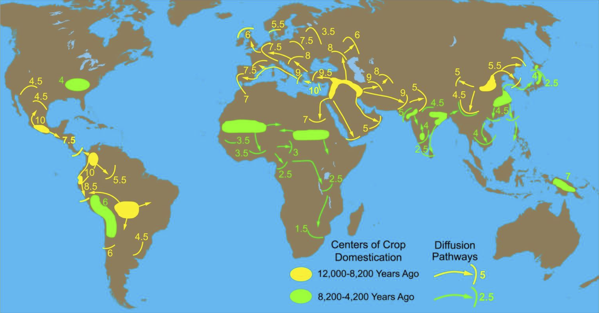
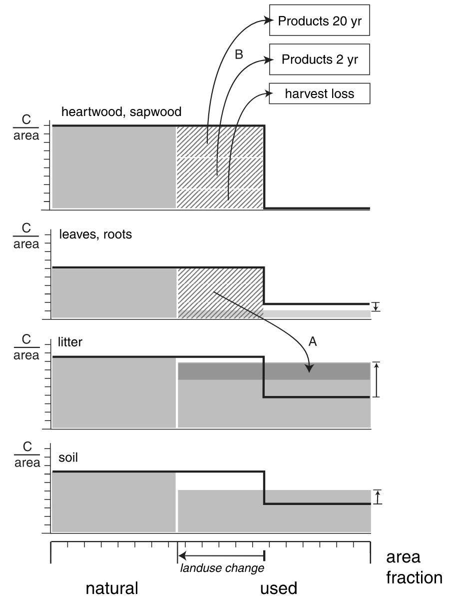
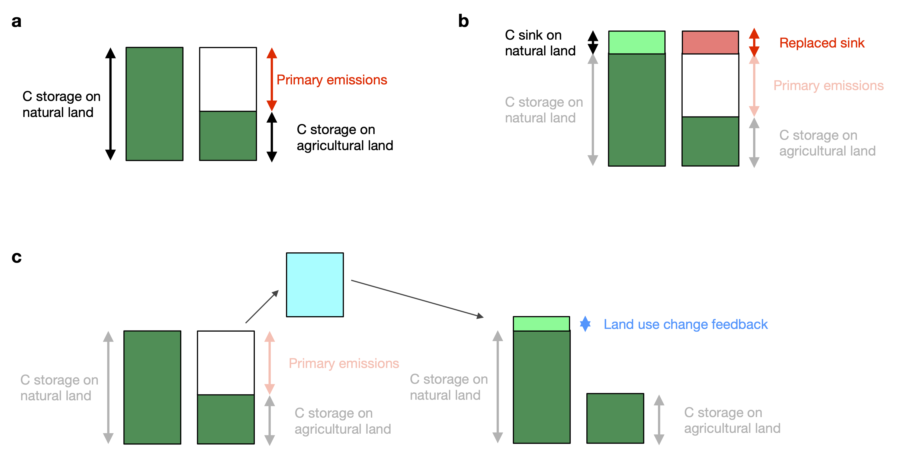
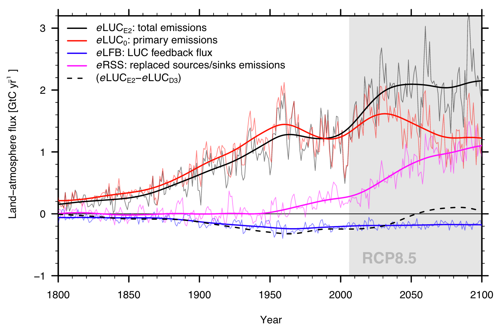

# Land use change {#sec-landusechange}

Land use describes human activities on land, such as crop cultivation, livestock grazing, wood harvesting, and settlement. Land cover describes the physical surface, such as forest, grassland, or built-up area. The distinction matters: harvesting a forest can alter its carbon stocks without permanently changing its land use, while grazing can modify an ecosystem without producing a clear change in its satellite-observed cover. Here, *land use change* (LUC) includes the effects of land use and management, including forestry, as well as conversion between land uses. These activities are commonly grouped as *land use, land-use change, and forestry* (LULUCF).

Land use connects human demand for food, materials, and energy with changes in terrestrial carbon storage and in the exchange of water and energy with the atmosphere. This chapter follows that chain from drivers and spatial patterns to Earth system effects and their quantification.

## Drivers of land use change {#sec-luc-drivers}

### Proximate and underlying causes {#sec-proximate-underlying}

The *proximate causes* of land use change are the activities that directly alter the land surface. They include wood extraction for energy and materials, agricultural expansion through permanent or shifting cultivation and livestock grazing, and the construction of settlements, roads, and other infrastructure. These activities often interact: road construction can make previously inaccessible forests available for timber extraction and subsequent agricultural conversion [@geist02biosci].

The *underlying causes* explain why these activities occur at a particular time and place. Demographic factors include population size, density, distribution, and migration. Economic factors include consumption, market growth, urbanisation, industrialisation, and trade. Technology changes agricultural yields and the costs of cultivation, transport, and wood harvesting. Policies and institutions influence property rights, access to land, law enforcement, development support, and incentives such as carbon markets. Conflict and political instability can also change land management. Land use change therefore cannot generally be explained by population growth alone [@geist02biosci].

Environmental conditions constrain these social and economic drivers. Soil fertility, climate, vegetation productivity, water availability, and topography determine the suitability and productivity of different land uses. Fires and climatic extremes can alter vegetation and subsequent land-use decisions. Although satellite observations of forest loss may not directly establish causal drivers, certain patterns in forest conversions, however, enable an association and therefore a global mapping of drivers of forest loss. @curtis18sci thus estimate that 27% of forest loss between 2000-2015 was driven by cropland expansion for commodity production, 26% by forestry (wood extraction), 24% by shifting cultivation, and 23% by wildfires. 

### Demand, productivity, and land area

The proximate and underlying drivers of land use change describe above (@sec-proximate-underlying) complicate simple relations between population and the extent of land under use for producition in agriculture or forestrly. The smaller spatial scale considered, the more land use and population become decoupled. This reflects the spatial disconnect between producing areas and consumers and the network of trade and transport of agricultural and forestrly products. Yet, at larger scales, the land area under use in agriculture and forestry can be expressed in with the follwoing simple model:

$$
A(t) = P(t)\,a(t),
$$ {#eq-luc-area}

where $A$ is the area under use in agriculture, $P$ is population, and $a$ is the per-capita land requirement. Like the Kaya identity for emissions, this separates population from the other influences on resource use. Per-capita land requirements depend on consumption, diets, food losses, production efficiency, and yields. For a single product, with consistent units and ignoring trade and stock changes, $a=c/Y$, where $c$ is per-capita consumption and $Y$ is production per unit area.

Higher yields can reduce the area needed for a given level of production. Whether this leads to less land conversion depends on demand, prices, trade, and institutions: lower production costs can also make expansion more profitable. Trade separates where products are consumed from where land is used. Thus, demand is translated into geographically specific choices about crop types, irrigation, management, and grazing, rather than into a fixed amount of land per person. It is important to note that through the globalisation of trade and transport of agricultural goods, land use decisions have to be viewed in a globally connected system. For example, land protection can lead to *land use spill-over*, where pressure on land use expansion may increase to meet an unchanged demand for related goods [@meyfroidt20erl]. 

## Global and historical patterns of land use change {#sec-luc-patterns}

### Present-day cropland and crop types

Croplands are concentrated where climate, soils, and terrain support cultivation and where markets and infrastructure make production viable. Major concentrations include the North American plains and mid-west, Europe and western Russia, India, and eastern China. Agriculture also occupies extensive areas of South America and sub-Saharan Africa. These broad patterns are visible in the satellite-based overview for 2025 (@fig-map_crop_past).

![Global cropland overview for 2025, based on Sentinel-2-derived land-cover information [@io2026landcover; @karra21igarss]. Data displayed is resampled to 0.1° from its original spatial resolution.](images/cropland_2025_global.png){#fig-map_crop_past width=100%}

Satellite classifications describe observed cover, whereas reconstructions combine statistics, observations, and allocation assumptions to describe land use. In the satellite product used here, the crops class includes low-growing crops and structured fallow plots, while tree plantations can be classified as trees. It is therefore not a complete inventory of agricultural land. The Land-Use Harmonization dataset (LUH2) provides a consistent reconstruction of agricultural land and management at 0.25° resolution [@hurtt20gmd].

The LUH2 crop map distinguishes five functional groups: C~3~ annuals (including wheat and rice), C~4~ annuals (including maize and millet), C~3~ perennials (including tree crops), C~4~ perennials (including sugarcane), and C~3~ nitrogen-fixing crops (including soybean and pulses). These groups differ in photosynthetic pathways, seasonality, allocation, and management, which matter for modelling carbon and water exchanges (@sec-gpp). The map identifies the largest group within a cell, not an individual crop species.

![Dominant crop functional type in 2015 from LUH2 v2h, based on HYDE 3.2 [@hurtt20gmd]. Colours identify the largest of five crop groups on the native 0.25° grid. Cells with less than 1% cropland are left grey; a coloured cell can contain several crop groups and non-agricultural land.](images/dominant_crop_types_2015.png){#fig-luc-crop-types width=100%}

### Irrigation, managed pasture, and rangeland

Irrigation supplements precipitation and allows cultivation in water-limited climates or during dry seasons. Its distribution reflects both water availability and crop requirements, including rice cultivation in monsoon regions. Irrigated area expanded strongly during the twentieth century, especially in South and East Asia [@siebert15hess]. Its Earth system effects include altered evapotranspiration, surface temperature, and atmospheric humidity, but also freshwater withdrawal and groundwater depletion [@siebert10hess].

![Irrigated cropland in 2015 from LUH2 v2h [@hurtt20gmd]. Values are irrigated crop area as a percentage of the full 0.25° grid cell, calculated by multiplying each crop group's area by its irrigated fraction and summing across groups.](images/irrigated_cropland_2015.png){#fig-luc-irrigation width=100%}

Grazing occurs across a wider climatic range than crop cultivation, including dry regions and cool or mountainous terrain. It is useful to distinguish *managed pasture*, where vegetation is managed for forage production, from *rangeland*, where livestock use largely natural or semi-natural vegetation. This distinction explains why estimates labelled simply as "pasture" can differ greatly among datasets. In particular, the pasture maps used here exclude the much more extensive rangelands.

![Managed pasture in 2015 from the LUH2 v2h `pastr` variable [@hurtt20gmd]. Colours indicate the supplied fraction of the full 0.25° grid cell occupied by managed pasture.](images/managed_pasture_2015.png){#fig-luc-managed-pasture width=100%}

![Rangeland in 2015 from the LUH2 v2h `range` variable [@hurtt20gmd], shown as a fraction of the full 0.25° grid cell. The pasture and rangeland maps describe land-use area, not measured livestock stocking density or grazing intensity.](images/rangeland_2015.png){#fig-luc-rangeland width=100%}

### Recent forest-cover change

The regional forest-change maps illustrate different spatial patterns of disturbance and recovery. Agricultural frontiers can produce expanding blocks of clearing (@fig-cropland_change a), while managed forests can show repeated harvesting and regrowth (@fig-cropland_change c). Fire can affect large contiguous areas (@fig-cropland_change d).

![Tree-cover loss and gain in four regional windows: (a) Paraguay, (b) Indonesia, (c) USA, and (d) Russia. Redrawn from Hansen Global Forest Change v1.13 [@hansen13sci; @hansen2025gfc]. Orange denotes loss only during 2001–2025, blue gain only during 2000–2012, and purple locations with both. The background shows canopy cover in 2000. Source data have approximately 30 m resolution.](images/hansen_forest_loss_gain_regions.png){#fig-cropland_change width=100%}

### Land use since the Neolithic Revolution {#sec-hololu}

Farming emerged independently in several regions and spread over the early to late Holocene (@fig-neolithic). Domesticated crops and livestock differed among regions, but agricultural expansion increasingly displaced natural vegetation, including forests.

{#fig-neolithic width=85%}

#### Reconstructing historical patterns {#sec-hololu_patterns}

Reconstructions of early land use combine population estimates, assumptions about per-capita land requirements (following @eq-luc-area), and archaeological and palaeoecological evidence [@harrison20gmd; @stocker17pnas]. Improvements in agricultural productivity allowed per-capita land requirements to decline [@boserup65; @mazoyer06]. Consequently, small prehistoric populations need not imply proportionally small land-use footprints. Uncertainty remains large, especially where population histories and the extent of shifting cultivation are poorly constrained.

![Cropland (left column) and intensive pasture (right column) in the HYDE 3.5 baseline reconstruction: (a, b) 0 CE, (c, d) 1850 CE, and (e, f) 2025 CE [@kleingoldewijk2025hyde]. The original 5-arc-minute area fractions are conservatively remapped to a 0.1° display grid. Colours indicate percentage of full grid-cell area. Pasture excludes rangeland, and 2025 is an extrapolated reconstruction rather than a satellite observation.](images/hyde_land_use.png){#fig-luc_1ad_gaillard10cp width=100%}

The maps in @fig-luc_1ad_gaillard10cp show the long history of agriculture in Eurasia and the subsequent expansion and intensification of land use across continents. Summing the native HYDE 3.5 areas gives approximately 16.0 million km^2^ of cropland and 7.4 million km^2^ of pasture for its extrapolated 2025 baseline. These totals exclude rangelands and should not be interpreted as the entire area influenced by agriculture or grazing.

Evidence independent of population-based reconstructions helps constrain these histories. For example, charcoal and changes from tree pollen towards cereal pollen in lake sediments can indicate burning, forest clearance, and cultivation (@fig-pollen; @gaillard10cp). Archaeological and palaeobotanical evidence also indicates substantial pre-Columbian land use in parts of the Americas, although its extent remains uncertain [@lewismaslin15nat].

For a realistic assessment of carbon cycle impacts of past land use change, the permanency of cultivation plots and the duration of fallow cycles must be considered. These practices differed widely acros regions and tended towards land use intensification and enhanced land prodcutivity over time [@mazoyer06].  

## Effects of land use change {#sec-luc-effects}

### Biogeochemical effects: carbon stocks and productivity

Conversion from forest to cropland or pasture removes much of the carbon stored in wood. Some is released rapidly through burning, while some enters dead organic matter or harvested products and is emitted during later decomposition. Crops can have high photosynthetic rates during their growing season, as satellite fluorescence measurements demonstrate for productive agricultural regions [@guanter14pnas]. High productivity does not imply high carbon storage: frequent harvest, short tissue lifetimes, and little allocation to persistent wood keep standing stocks low (@tbl-allocation; @sec-ccascade).

Soil carbon responds to both changes in organic inputs and changes in decomposition. Harvest and residue removal reduce the amount of plant material returned to the soil. Root production and turnover supply belowground inputs, while retaining residues or applying mulch can maintain carbon inputs. Tillage changes soil structure and exposes organic matter to decomposition. The balance depends on the original ecosystem, soil, climate, and management. A synthesis of land-use conversions found that conversion to cropland generally reduced soil carbon, whereas conversion to pasture had more variable effects and could increase soil carbon [@guogifford02gcb]. Loss of forest biomass therefore does not translate into the same proportional loss from soil and strongly depends on the subsequent use and management practices.

Abandonment, reforestation, and afforestation can reverse some of these stock losses, but recovery takes time and need not restore the original ecosystem. The immediate emissions from clearance and the slower uptake during regrowth create a legacy of past land use in today's carbon fluxes. 

Agriculture also affects other greenhouse gases, including CH~4~ and N~2~O; their processes are discussed in the chapters on nitrogen (@sec-nitrogen) and greenhouse gases (@sec-ghg).

### Biogeophysical effects: albedo, roughness, and evapotranspiration {#sec-biogeophysical}

Land use also changes the surface energy and water balances without first acting through atmospheric CO~2~. These *biogeophysical effects* depend on differences in albedo, vegetation height, leaf area, stomatal conductance, rooting depth, and water supply [@bonan08sci]. They interact with the *biogeochemical* warming caused by carbon release.

Replacing forest with shorter vegetation generally increases surface albedo and reduces absorbed solar radiation (@sec-albedo). The contrast is particularly strong when snow is present (*snow masking effect*): open land exposes bright snow that a forest canopy would partly mask (@fig-snow-masking). This provides a cooling influence, especially in boreal regions.

Forests also have a rougher surface than crops or grasslands. Their roughness generally promotes turbulent exchange with the atmosphere. Shorter vegetation has lower aerodynamic conductance, or equivalently higher aerodynamic resistance, under comparable atmospheric conditions (@fig-surface-resistance). Canopy conductance additionally depends on leaf area and stomatal behaviour. Deep roots can sustain transpiration during dry periods, whereas shallow-rooted vegetation may become water-limited sooner (@sec-rzwsc). Seasonal crop growth and harvest create further contrasts with forest.

These differences influence the partitioning of available energy between latent and sensible heat (@sec-energybalance). Reduced evapotranspiration limits evaporative cooling and can warm the surface. Irrigation can sustain or increase evaporation from cropland, so conversion does not always reduce evapotranspiration. The balance between effects by albedo, turbulent exchange, and water availability strongly affects the overall effect by land use change on near-surface climate.

### Convection and regional moisture recycling

Land-use mosaics produce contrasts in surface temperature, sensible heat, and humidity. Strong sensible heating can deepen the atmospheric boundary layer, whiule strong evapotranspiration moistens the boundary layer. Both can influence the initiation of convection, but their effects depend on the temperature and humidity profile of the overlying atmosphere [@findell03jhm]. Observations of afternoon rainfall over relatively dry patches illustrate that more local evaporation does not necessarily mean more rain directly overhead [@taylor12nat]. Forest edges can also affect airflow through abrupt changes in roughness, contributing to convergence and cloud formation [@teuling17natcomm].

The effects extend downwind because evaporated water is transported before it precipitates. Globally, an estimated 1.7% of terrestrial evaporation returns as precipitation within roughly 50 km of its source [@theeuwen23hess]. Over larger scales, this fraction increases, and moisture recycling at continental scales can be substantial. An atmospheric moisture-tracking analysis estimated that about 63% of evaporation from the Amazon basin precipitates again within that basin [@tuinenburg20essd]. This is the fraction of evaporation returning, not the fraction of Amazon precipitation supplied by local evaporation. The latter also includes moisture imported from outside the basin in its denominator.

Deforestation can therefore affect rainfall beyond the cleared area by reducing atmospheric moisture supply. An analysis of southern Amazon precipitation trends attributed much of the observed decline to reduced recycled moisture associated with deforestation [@cui26natcomm]. These connections mean that changes in forest cover, agricultural water use, and rainfall need to be considered at the scale of connected regions.

### Remote climate effects and latitude dependence

Changes in heating, humidity, and clouds can alter atmospheric circulation and affect climate far from the modified land. Large-scale deforestation experiments with Earth System Models illustrate a broad latitudinal contrast: deforestation can favour cooling in boreal regions through snow-related albedo effects, whereas reduced evapotranspiration and carbon release favour warming after tropical deforestation [@bala07pnas]. Temperate responses are more dependent on season and location.

{#fig-luc_biogeophysical width=100%}

Cloud changes affect both reflected sunlight and outgoing longwave radiation; their net effect depends on cloud properties and location. The climatic consequences of forest removal or recovery thus require joint consideration of its geographic location, and of carbon, water, energy, and circulation, rather than a single universal temperature effect.

## Estimates of land use change CO~2~ emissions and C cycle impacts {#sec-luc-estimates}

### Quantification methods {#sec-luc_methods}

Three main methods for quantifying CO~2~ emissions from land use change can be distinguished.

#### Remote sensing-based models

C stocks in aboveground biomass and land cover types can be estimated from remotely sensed information. Using additional information (for example about the delineation of protected areas), the potential natural vegetation (PNV) and its aboveground biomass stocks can be estimated across the globe [@erb18nat]. By comparing the PNV and actual aboveground biomass stocks, an estimate can be made for the cumulative loss of C from aboveground biomass, caused by anthropogenic land use and how it evolved until its present state. Additional assumptions about the relations of above to belowground biomass and soil C stocks enable an estimation of the cumulative land use change C emissions. This method does not generally enable the consideration of temporal dynamics in land use change and the emission rates per unit time. It also doesn't account for delayed emission and uptake which may arise in view of the relatively long turnover times of C in soil and wood products. The advantage of remote sensing-based models is that they consider observations-informed C stock estimates and provide a spatially-explicit picture of land use change emissions.

```{r echo=FALSE}
#| label: fig-luc_pnv_erb18nat
#| fig-cap: "Potential biomass (a), actual biomass (c), and their difference due to land conversion (c) from @erb18nat. The potential biomass map is from their remote-sensing derived map (their Extended Data Figure 4e). The acutal biomass map is from their remote-sensing derived maximum (their Extended Data Figure 3f. The difference is from their Extended Data Figure 5a.)"
#| out-width: 100%
knitr::include_graphics("images/luc_pnv_erb18nat.png")
```

#### Bookkeeping models

Using information about country and sub-country-level forest area changes and forest C density (C stock per unit area in different ecoystem types, including forest, croplands, and pastures), bookkeeping models simulate the dynamics of biomass and soil C loss upon deforestation and harvesting and upon recovery after agricultural land abandonment. The basis for simulating these dynamics are empirical forest regrowth curves (@fig-forest_regeneration_pugh19pnas). Bookkeeping models do not resolve the spatial dimension, but do the accounting ("bookkeeping") on the basis of political units at which forest areal data is provided. Bookeeping models also do not commonly consider the effects of environmental change on the C balance of forest and agricultural ecosystems. However, they do account for the full dynamics and the fate of C in different pools, considering also the the lifetime of wood products.

#### Dynamic Global Vegetation Models

These models simulate the exchange of carbon, water, and energy between the land surface and the atmosphere by representing the CO~2~ uptake by photosynthesis, the dynamics along the C cascade [@sec-ccascade], biogeophysical properties and processes. All processes are simulated dynamically over time and across a spatial grid that commonly spans the globe. DGVMs commonly represent multiple land portions within each gridcell, distinguishing natural vegetation, croplands, pastures, and built-up land. Land use change is implemented by dynamically altering the relative portions of these land use types. E.g., an expansion of the cropland portion at the expense of the natural vegetation portion would lead to a diversion of a corresponding fraction of the woody biomass C from the natural gridcell portion into litter pools and into wood product pools (@fig-luc_schematic_strassmann08) from where the C is subject to further decay and emission as CO~2~. Conversely, abandonment of agricultural land is simulated as an expansion of the non-agricultural gridcell portion, enabling natural vegetation regrowth. In response, models then dynamically simulate (if the gridcell's climate is suitable for tree establishment) forest regrowth and the accumulation of C in biomass stocks. Emissions attributed to land use change are then calculated as the difference of the net C balance (net biome productivity, NBP, see @sec-nbp) between a simulation with dynamically changing land use change and a simulation where the distribution of land use is held constant. Depending on whether model forcings (climate, CO~2~) are temporally varying or not, indirect land use change effects on the carbon cycle are included in DGVM-based estimates or not (see @sec-luc-direct-indirect).

```{r echo=FALSE}
#| label: fig-luc_schematic_strassmann08
#| fig-cap: "Redistribution of carbon during the transformation of natural land to cropland and pasture. The horizontal axis indicates the split of a given cell into natural vegetation and agricultural land (built-up area is omitted for simplicity). The vertical axes indicate carbon density on natural or used land in different compartments. Thus, the carbon content per grid cell of each pool corresponds to the area of the individual boxes. The arrow on the horizontal axis indicates a reduction of natural and expansion of used land (conversion). The state before the conversion is shown by the bold lines. The state immediately after the conversion is shown by gray boxes. Carbon densities on used land change upon conversion as indicated by the vertical arrows on the right-hand side. Figure and caption text from @strassmann08tellus."
#| out-width: 60%

```

### Global and regional emission estimates {#sec-luc_emissions}

The Global Carbon Budget 2025 estimates mean net land-use-change emissions of 1.4 $\pm$ 0.7 PgC yr^-1^ for 2015–2024 [@friedlingstein26essd]. Cumulative emissions for 1750–2024 are estimated at 280 $\pm$ 65 (@tbl-gcb). Their long history makes land use an important contributor to cumulative anthropogenic emissions even though fossil fuels dominate present-day annual emissions.

![Global annual net land-use-change C emissions during 1850–2024 from the Global Carbon Budget 2025 [@friedlingstein26essd]. The line is the mean of the three bookkeeping models used in the Global Carbon Budget. Shading spans their minimum and maximum annual estimates. Positive values indicate net emissions and negative values net removals associated with land use.](images/global_land_use_emissions_1850_2024.png){#fig-luc_emissions width=100%}

The global series hides contrasting regional histories and current trends (@fig-luc-regional-emissions). North America and Europe show earlier contributions associated with their land-use histories, while Latin America and the Caribbean, Africa, and South and Southeast Asia dominate recent net emissions in these estimates. Regional declines can reflect reduced conversion, increased regrowth, or changing management.

![Annual regional net land-use-change emissions during 1850–2024 [@friedlingstein26essd]: (a) North America, (b) Latin America and the Caribbean, (c) Europe excluding Russia, (d) Russia, (e) Africa, (f) East Asia, (g) South and Southeast Asia, (h) West and Central Asia, and (i) Oceania. Countries are summed within each model before calculating the three-model mean and range. All nine panels use the same axes. Russia is separate from Europe; Mexico is included in Latin America and the Caribbean. Other and disputed territories are omitted from these panels but included in the global total. The shading represents model spread.](images/regional_land_use_emissions_1850_2024.png){#fig-luc-regional-emissions width=100%}

A regional net removal associated with land use is not the same as the region's entire terrestrial sink. The land-use term includes regrowth following human disturbance, whereas the global carbon budget distinguishes this from uptake driven by environmental changes such as rising CO~2~ (@sec-gcb). Annual estimates also contain legacy fluxes: they cannot be interpreted as emissions only from land cleared in that year.

### Gross and net changes, shifting cultivation, and legacy fluxes

Land conversion and multi-directional land use transitions, e.g. from natural vegetation to cropland and abandonment of cropland area and subsequent regrowth of natural vegetation, may occur simultaneously within small regions. This can imply substantial land use dynamics, beyond what the regional total extent of land use, e.g. as cropland, indicates. *Gross land-use transitions* describe all conversions between land use classes, while *net land use change* describes only the change in their total areas within a given region or spatial extent. While C loss from aboveground biomass stocks is rapid upon deforestation, its re-accumulation after cropland abandonment and fallow periods is slow, evolving over decades (@fig-forest_regeneration_pugh19pnas). Thus, at any point in time, a landscape affected by dynamic land use transitions may contain patches of secondary forest that are at different stages of recovery and re-accumulation of C stocks. Compared to a landscape where plots under agricultural use are permanent and other vegetation, e.g. forest, is not affected by prior deforestation, the regionally or larger-scale spatially aggregated C stocks are reduced.

This is particularly relevant for capturing the effect of *shifting cultivation*-type cropland cultivation on a region's C balance. Shifting cultivation refers to the practice of a crop and forest use rotation cycle, where plots used for crop cultivation are non-permanent, mostly due to the rapid loss of soil fertility in tropical regions. A rotation cycle of several years to decades is established where plots under fallow are left to regrow trees, sometimes used in combination with sustained crop cultivation in agro-forestry systems. A cycle is re-initiated when previously abandoned cultivation plots, now sustaining secondary forest, are converted for renewed crop cultivation. A global assessment estimated approximately 2.8 million km^2^ of shifting-cultivation landscapes around 2010, including both cultivated fields and fallows [@heinimann17plos]. Across the globe, shifting cultivation is responsible for 24% of gross forest loss [@curtis18sci]. However, due to the simultaneous re-establishment of forests and reaccumulation of C stocks in such systems, the net effect is smaller. Yet, global modelling studies suggest that the effect of representing gross, compared to net land use changes in global C cycle models increases global historical LUC C emission estimates by 20-30% [@stocker14tellus; @arneth17natgeo].

{#fig-gross-net-luc width=40%}

Similarly, wood harvesting in an established forest is often not associated with a land use *change*, and the affected land area remains forested or may regrow to forest after clear-cut. Hence, gross deforestation within a certain area may be large, even if the net deforestation is small or zero. Simultaneous loss and re-accumulation of C stocks partly (but not fully) compensate each other. Hence, wood extraction generally implies reduced standing stocks in recovering (secondary) forests across affected regions, compared to a region featuring only unused (primary) forest. Wood harvest-associated net CO~2~ emissions (after accounging for compensating effects of re-growing forest) are substantial at the global scale, increasing global historical LUC C emission estimates by 15-25%  [@stocker14tellus; @arneth17natgeo].

### Direct and indirect effects on the carbon cycle {#sec-luc-direct-indirect}

Land use change influences the carbon storage capacity in multiple, direct and indirect ways. The following components of land use change effects on the C cycle can be distinguished.

```{r echo=FALSE}
#| label: fig-direct_indirect_luc_emissions
#| fig-cap: "Direct and indirect C emissions from land use change. (a) primary emissions, determined by the reduction of C storage on agricultural land compared to natural land. (b) The replaced sinks/sources are determined by the difference of the environmental change-driven additional (reduced) C storage on natural land compared to agricultural land. In the illustration, it is assumed that environmental change drives an increase C storage on natural land (light green) and no change on agricultural land. (c) The land use change feedback flux is caused by the environmental change-induced additional (reduced) C storage on both natural and agricultural land. In the illustration, the atmospheric CO~2~ increase induced by primary emissions is assumed to lead to an increase in the C storage on natural, but not on agricultural land."
#| out-width: 100%

```


  1. **Primary emissions**: These consider the C loss caused by conversion of natural to agricultural land use without considering effects of and on climate and atmospheric CO~2~. Using Dynamic Global Vegetation Models, primary emissions can be computed by simulations where climate and atmospheric CO~2~ are held constant. Bookkeeping models yield primary emissions and do not, by design, consider additional components.
  2. **Replaced sinks/sources**: Conversion of natural to agricultural land use affects the C sink or source strength of an ecosystem under changing environmental conditions. Model simulations suggest that particularly tropical forests are an important C sink under rising CO~2~, while tropical croplands are not. This difference affects the global C budget (@sec-gcb) and, following the simulation setup for Dynamic Global Vegetation Models used for its quantification [@friedlingstein24essd], is commonly ascribed to land use emissions, the term $E_\text{LUC}$ in the global C budget (@eq-carbon_budget). The replaced sinks/sources flux can become a quantitatively important component of the effect of LUC on the C cycle, particularly in a future scenario where land conversion rates decline (and hence primary emissions decline), while atmospheric CO~2~ keeps rising (@fig-eluc_components).
  3. **Land use feedback**: The change in atmospheric CO~2~ and climate, caused by land use change (primary emissions) triggers effects on the C balance of the terrestrial biosphere. In model simulations, this effect leads to a reduction by around 20% of the net effect on atmospheric CO~2~ mainly through the fertilisation effect of the land use change-derived CO~2~ atmospheric CO~2~ increase [@stockerjoos15]. The land use feedback flux can only be separated from emission-driven simulations in coupled Earth System Models (where atmospheric CO~2~ is simulated interactively). The magnitude of the flux scales approximately in proportion to primary emissions.

```{r echo=FALSE}
#| label: fig-eluc_components
#| fig-cap: "Flux components of land use change emissions. Total emissions as derived from an emission-driven, coupled Earth System Model setup (E2 method), and calculated with Eq. (4), are given by the black lines. Primary emissions under preindustrial boundary conditions are given by red lines. The replaced sinks/sources flux (eRSS) and the land use change feedback flux (eLFB) are given by magenta and blue lines, respectively. The difference between total emissions quantified by D3 method and E2 method is given by the black dashed line. Bold lines are splines of annual emissions given by thin lines. Results are from simulations following CMIP5 model inputs (historical until 2005, RCP8.5 until 2099). Figure and caption text from @stockerjoos15."
#| out-width: 80%

```

### Land use and the Holocene carbon balance

Early agriculture contributed carbon emissions before the industrial period, but atmospheric CO~2~ records reflect the net balance of multiple sources and sinks. Isotope-based reconstructions indicate comparatively small net terrestrial carbon changes after the mid-Holocene (@fig-land_c_balance_past). This does not imply that land-use emissions were absent: uptake elsewhere, including accumulating peatlands, could offset releases. A synthesis of Holocene sources and sinks identified substantial natural contributions and concluded that a clearly dominant global human influence emerged only in recent centuries [@stocker17pnas]. Reconciling these records requires land-use histories, peatland accumulation, and other environmental changes to be considered together.

## Forest recovery and climate mitigation

Forest regeneration and afforestation have a significant potential to sequester C at relatively low cost. The biophysical potential total carbon uptake is estimated to range between 72 PgC [@taylormarconi20] to 226 PgC [@mo23nat]. The large range of estimates is likely linked to differences in the consideration of soil C changes with varying tree cover and indicates a relatively large uncertainty in estimates. In addition, a holistic assessment of the potential of forest regeneration and afforestation as climate mitigation has to additionally consider biogeophysical effects (deforestation tends cool near surface air temperatures in some regions, @sec-biogeophysical), socio-economic constraints, and legal, political, and cultural aspects of human land use. The following points summarise these limitations:

-	Land use conflict: The amount of land that can be dedicated to afforestation or regeneration is subject to competing land uses, including wood harvesting and other uses of forest products. Furthermore, global estimates [@mo23nat] assume complete availability of extensively used lands for forest plantations (e.g., low-productivity grasslands currently used for ranging). The use of land for biomass C stock maximisation also creates a use conflict with land for bioenergy production.
-	Water use conflict: Climate and soil conditions affect tree growth rates and carbon storage potential. Enhanced evapotranspiration on afforested land may lead to streamflow reductions and reduced water availability for human use, creating a water use conflict [@peng24natwater].
-	Permanence and risk of disturbance: The potential carbon gains from regeneration and afforestation are at risk from natural disturbances such as wildfires, insect outbreaks, [@anderegg20sci]. Limited permanency of C (the turnover time of C in forest biomass is on the order of decades to centuries) indicates that forest regeneration and afforestation should not be used to compensate C released from fossil fuels where C had stored in organic matter for millions of years.
-	Forest management and protection: Long-term permanency of C in afforestations and regenerated forests is subject to management practices and the long-term protection from logging and other human-induced disturbances. This implies that the economic, political, and legal context is critical for guaranteeing long-term permanency. However, such guarantees may not be given at the time when decisions about compensating C emissions fossil fuels are made.
-	Delayed benefits: Forests take decades to centuries to reach their full potential C stocks (@fig-forest_regeneration_pugh19pnas). This implies a limited potential as a near-term (within the next 1-3 decades) climate mitigation solution at scale.