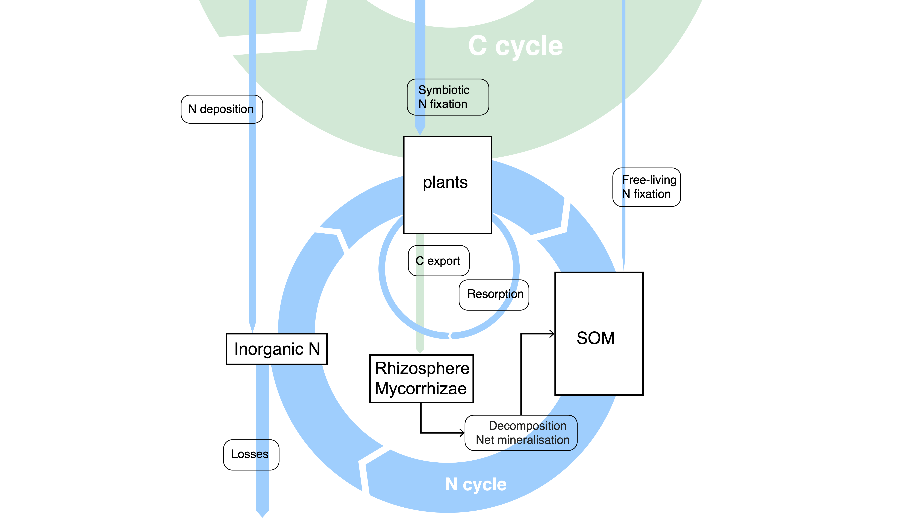

# Nitrogen cycle {#sec-nitrogen}

## Overview

Nitrogen (N) is needed for the synthesis of biomass and is thus essential for life and for sustaining the carbon cycle. N is abundant in the atmosphere, however it is present mostly as molecular nitrogen, N~2~, whereas organisms generally require *reactive nitrogen*, N~r~, to build biomass and sustain vital functions. Converting N~2~ into these usable forms requires specialised biological or physical processes. Nitrogen can therefore be scarce for organisms despite them being surrounded by a vast atmospheric reservoir.

Under natural conditions, new inputs of reactive N to terrestrial ecosystems are small compared with the amount of N used each year in terrestrial primary production. Most of this demand is met by recycling: plants recover N from senescing tissues and by renewed uptake of mineralised dead organic matter. Only a relatively small fraction of N enters the terrestrial cycling through biological fixation and deposition of reactive N species.

Human activities have greatly increased new N~r~ inputs into the terrestrial biosphere through industrial fixation, cultivation of N-fixing crops, and combustion of biomass. The combustion of biomass and fossil fuels produces airborne N~r~. This perturbation has increased N pollution and emissions of the greenhouse gas N~2~O, while additional N~r~ inputs may have also contributed to the sustained C sink in the terrestrial biosphere [@devries09]. The chapter first introduces N species, reservoirs, transformations, and the (re-)cycling of N in terrestrial ecosystems. Then, an overview of global budgets and interactions with the C cycle is given.

## Nitrogen species and reservoirs in the Earth system

About half of all N on Earth is present as N~2~ gas in the atmosphere, while the other half is contained in the Earth's mantle and crust. The cycling between these compartments is extremely slow at a turnover time of about 1 biollion years [@canfield10sci].

### Atmosphere

About 78% of dry air by volume consists of N~2~ (@fig-nitrogen-air). More precisely, the dry-air mole fraction is approximately 78.09%. (Mole and volume fractions are nearly equivalent for gases under atmospheric conditions [@noaa_air_composition].) The atmospheric stock is about $4\times10^{6}$ Pg N. This is an enormous reservoir compared with the N in vegetation (3.8 Pg N) and soils (95-140 Pg N) [@schulze19; @schlesingerbernhardt13]. Comparing the atmospheric N stock with the rate of removal by terrestrial and oceanic N fixation (0.11 Pg N yr^-1^ for terrestrial and 0.14 Pg N yr^-1^ for oceanic N fixation, @gruber2008) yields a turnover rate of 16 mio. years.

![Composition of dry lower-atmospheric air, using the approximate mid-2020 values: 78.09% N~2~, 20.936% O~2~, 0.930% Ar, 0.0413% CO~2~, and 0.0027% other gases. Here, Ar (Argon) and carbon dioxide (CO~2~) are not explicitly displayed, but are subsumed in 'Other'. Water vapour is excluded because its abundance varies strongly. [@noaa_air_composition].](images/nitrogen/atmospheric_composition.svg){#fig-nitrogen-air width=100% fig-alt="Stacked bars showing nitrogen and oxygen dominating dry air and an enlarged view of argon, carbon dioxide and other trace gases."}

A set of further N-containing molecules are contained in the atmosphere (@tbl-nitrogen-species ), but at much lower concentrations. Yet, they have important roles as agents in atmospheric chemical transformations, including aerosol production and ozone depletion. In addition, N~2~O is a strong greenhouse gas (@sec-ghg). In view of their role in atmospheric chemical transformations, as well as biological processes (@sec-nitrogen-ecosystems), these species are referred to as *reactive nitrogen* (N~r~).

The ultimate reason for the strong dominance of N present as N~2~ vs N~r~ is the strong triple bond in N~2~, which presents an energetic barrier to its conversion and implies a tendency of chemical reactions to convert N~r~ back to N~2~ in view of its lower chemical energetic state. 

<!-- Over evolutionary time scale, the capacity for biological N~2~ fixation, that is the transformation of gaseous N~2~ into reactive forms, arose in only a restricted set of bacteria and archaea. Most organisms obtain the products of fixation, directly or after further transformations, rather than breaking this bond themselves. -->

| Formula | Name | Atmospheric grouping or role |
|:--|:--|:--|
| N~2~ | Molecular nitrogen, or dinitrogen | Outside N~r~ |
| NH~3~ | Ammonia | NH~x~; gas |
| NH~4~^+^ | Ammonium | NH~x~; dissolved or particle-bound |
| NO | Nitric oxide | NO~x~ and NO~y~ |
| NO~2~ | Nitrogen dioxide | NO~x~ and NO~y~ |
| HNO~3~ | Nitric acid | NO~y~ |
| NO~3~^-^ | Nitrate | NO~y~ when in atmospheric particles or droplets |
| NO~2~^-^ | Nitrite | Important aqueous/soil intermediate; distinct from NO~2~ gas |
| N~2~O | Nitrous oxide | Treated separately from NO~y~ |

: Principal nitrogen species and commonly used atmospheric groupings. NO~x~ comprises NO + NO~2~; NO~y~ includes NO~x~ and its oxidised reaction products; NH~x~ comprises NH~3~ + NH~4~^+^ [@fowler_effects_2015]. {#tbl-nitrogen-species}

<!-- | N~2~O~5~ | Dinitrogen pentoxide | NO~y~; atmospheric oxidised-N reservoir | -->
<!-- | CH~3~C(O)O~2~NO~2~ | Peroxyacetyl nitrate (PAN) | Organic member of NO~y~ | -->
<!-- | R–NH~2~, proteins, and other organic compounds | Organic nitrogen | Diverse pool; most is outside NO~x~, NO~y~, and NH~x~ | -->


NO~x~ participates in sunlight-driven ozone production and influences the abundance of OH radicals, thereby affecting methane's lifetime. Oxidation produces nitric acid and other NO~y~ compounds. Ammonia reacts with acids to form particles such as ammonium nitrate and ammonium sulphate aerosols, which affect air quality, radiation, and clouds. N~2~O absorbs infrared radiation and, after transport to the stratosphere, contributes to ozone destruction. Thus the small atmospheric abundance of these reactive N species has substantial environmental effects [@fowler_effects_2015].

### Terrestrial biosphere and soils

Most N in the terrestrial biosphere is organic N in dead and living material, with soil organic matter dominating the stock (95-140 Pg N), compared to around 3.8 Pg N in live vegetation [@schulze19; @schlesingerbernhardt13; @batjes16geoderma]. Plants use N in nucleic acids and proteins, including enzymes and structural proteins. Cellulose and lignin themselves contain no N. Soil microorganisms and animals also contain N, but much soil organic N is in microbial residues and other non-living material. These stocks must be distinguished from the small pool of inorganic N species contained in the soil, which rapidly turn over and are the principal supply for plant uptake (@sec-nitrogen-uptake).

A model-based quantitative example is the global natural-vegetation simulation of @xu-ri_terrestrial_2008. This model simulation produced 5.3 Pg N in vegetation, 4.6 Pg N in litter, 56.8 Pg N in soil organic matter down to 1.5 m, and 0.94 Pg N in inorganic soil pools -- the sum of ammonium and nitrate. This illustrates the dominance of organic N over inorganic N in the soil. O

### Ocean

The ocean contains dissolved N~2~, dissolved inorganic reactive N, dissolved organic N, and N in organisms and sinking particles. Molecular N~2~, around 24,000 Pg N [@johnsongoldblatt2015] is the dominant oceanic N species by mass. Nitrate is a major reservoir of biologically available N below the sunlit surface (around 590 Pg N [@garcia24]). Other N species in the ocean make up a much smaller portion of the total inventory. 

<!-- Phytoplankton assimilate nitrate, ammonium, and some organic compounds. Grazing, excretion, and decomposition recycle this N, while sinking organic matter connects surface production with deeper-water remineralisation. Circulation and mixing return some of the regenerated nutrients to the surface. Marine fixation adds reactive N, and denitrification and anammox in oxygen-deficient waters and sediments remove it, and produce N~2~O along this loss pathway [@gruber2008; @canfield2010]. -->

### Lithosphere and the deeper Earth

Nitrogen also resides in sediments and rocks, as organic N and as ammonium incorporated in minerals. Burial transfers biologically fixed N into sediments. Metamorphism, weathering, subduction, and volcanic degassing redistribute N over geological time. The mantle and core are additional deep-Earth reservoirs, beyond the lithosphere. Their inventories are uncertain, but estimates indicate that the solid Earth contains similar amounts of N than the atmosphere, that is around $4\times10^{6}$ Pg N [@johnsongoldblatt2015; @canfield2010]. Most of this N is inaccessible on ecological timescales. The smaller flux released by weathering of N-bearing rocks can nevertheless matter locally [@houlton18sci].

## Sources of reactive nitrogen {#sec-nitrogen-sources}

Creating new N~r~ requires conversion of N~2~. Biological fixation, lightning, and industrial fixation perform this conversion. Deposition, manure, and fertiliser application are inputs at the boundary of a field or ecosystem, but mostly transfer N that was already fixed elsewhere. Keeping these two meanings of input separate prevents double counting in global budgets.

### Biological nitrogen fixation

Biological nitrogen fixation (BNF) in terrestrial ecosystems is carried out by a wide variety of organisms, living either in direct symbiosis with plants or as free-living bacteria. Rhizobial and actinorhizal symbioses are mutualistic root-nodule associations where the plant hosts specialized soil bacteria that convert (fix) atmospheric N~2~ into reactive N (such as ammonium) in exchange for photosynthetic carbon. This exchange illustrates that the fixation of N consumes energy. For molybdenum nitrogenase, the principal enzyme responsible for BNF, the reaction illustrates the energy requirement:

$$
\mathrm{N_2 + 8H^+ + 8e^- + 16ATP
\longrightarrow 2NH_3 + H_2 + 16ADP + 16P_i}.
$$ {#eq-nitrogen-fixation}

Here, $P_i$ denotes inorganic phosphate. ATP hydrolysis, the energy source, and the supply of reducing power, the comsumption of free electrons ($e^{-1}$) support the conversion. Additional costs include construction and maintenance of nitrogenase, its protection from oxygen, and the acquisition of nutrients required for the construction and maintenance of nitrogenase (mostly phosphorous, sulphur, iron, and molybdenum). Due to the high energy demand and the construction and maintenance costs, symbiotic BNF is established only in a small subset of all land plants, mostly in legumes. 

However, a wide diversity of microbes, not all living in symbiosis with plants, carry out BNF [@vitousek_biological_2013]. Free-living BNF ocurs on the surface of plants, in leaves, in mosses, in decaying litter and dead organic matter, in biological soil crusts and in associations with lichens and mosses. Cyanobacteria Since plants capable of symbiotic BNF are often absent from the community and even when present, rates of symbiotic BNF may vary strongly, free-living BNF can constitute a substantial and often critical ecosystem input of reactive N [@reed_functional_2011]. Fixed ammonia is rapidly incorporated into organic compounds or protonated to ammonium.

Fixation also occurs in the ocean, through free-living microorganisms and symbioses, including cyanobacteria associated with phytoplankton. Access to light or organic energy sources, phosphorus and iron supply, temperature, and competition for fixed N control locations of where it occurs. Different diazotrophs protect nitrogenase from oxygen by different spatial or temporal arrangements [@canfield2010]. Global terrestrial and marine flux estimates are compared in @sec-nitrogen-global.

### Lightning and combustion

Lightning provides an abiotic fixation pathway: high temperatures allow N~2~ and O~2~ to react, forming NO that is subsequently oxidised. High-temperature combustion can likewise form NO~x~ from atmospheric N~2~. 

In contrast, the combustion of fossil fuels and biomass mobilises N that was previously fixed and is already present and in the fuel -- and not as N~2~ in the ambient air. Some of the combusted N-bearing organic material escapes as N~2~, some is emitted as NO~x~, NH~3~, N~2~O, and particulate or organic N. Deposition following a fire can supply a downwind ecosystem while the burned ecosystem loses N. Most of this flux is redistribution or removal of existing reactive N, rather than additional global fixation [@galloway04].

### Industrial fixation and mineral fertiliser 

The *Haber–Bosch process* reduces N~2~ with hydrogen to produce ammonia:

$$
\mathrm{N_2 + 3H_2 \rightleftharpoons 2NH_3}.
$$ {#eq-haber-bosch}

A catalyst, high pressure, and elevated temperature make industrial production possible. Energy is required for the process and for producing hydrogen. Ammonia is then used directly or converted into fertilisers such as urea and ammonium nitrate. Industrial fixation greatly expanded agricultural N supply beyond biological fixation and recycling (@sec-n-perturbation).

Applying mineral fertiliser transfers this industrially fixed N to a field. Manure transfers N previously assimilated by feed crops and consumed by livestock. Locally recycled manure conserves N within a farm, whereas imported manure or feed can add N across the farm boundary.

### Atmospheric deposition {#sec-nitrogen-deposition}

Emissions from combustion, soils (@sec-nitrogen-transformations), ammonia volatisiation in manure, and other biological sources supply atmospheric reactive N as inputs to terrestial and marine ecosystems. Subsequent chemistry changes its form and transport distance. *Wet deposition* removes gases and particles with precipitation. *Dry deposition* transfers them directly to vegetation, soil, water, and other surfaces without precipitation. Some NH~3~ is redeposited near its source. Longer-range transport connects emission regions with distant ecosystems. Deposition is therefore a source of N for a receiving ecosystem but not an independent global source of newly fixed N [@fowler_effects_2015].

## Soil transformations and gaseous losses {#sec-nitrogen-transformations}

Ammonium, nitrate, and smaller quantities of other inorganic N species occur in soil solution. A major source is the microbial breakdown of organic matter, which releases inorganic N through *mineralisation* (@sec-nitrogen-mineralisation). Inputs described above (@sec-nitrogen-sources) provide additional substrates. Once in solution, N can be taken up by plants and microbes, retained on soil surfaces, transported with water, or transformed by microorganisms (@fig-nitrogen-pathways). Plant acquisition is discussed in @sec-nitrogen-uptake.

The prevailing microbial transformations depend strongly on oxygen availability. Aerated pores favour nitrification, while oxygen-poor microsites favour denitrification. Both can occur simultaneously. Wetness changes both the connectivity of air-filled pores and the supply of dissolved substrates. Temperature affects microbial activity, but the response remains conditional on oxygen, substrate supply and removal [@butterbachbahl2013].

![Soil nitrogen transformations and gaseous escape. Original schematic following the process organisation of Fig. 1.5 in @stocker2013phd and the pathways in @xu-ri_terrestrial_2008. Nitrification oxidises ammonium to nitrate; denitrification reduces nitrate through gaseous intermediates to N~2~. Nitrification can also produce NO and N~2~O. Dashed arrows denote gas transfer to the atmosphere, not additional transformations. The diagram omits some alternative pathways, including anammox and nitrate reduction to ammonium.](images/nitrogen/soil_transformations.svg){#fig-nitrogen-pathways width=100% fig-alt="Diagram of organic nitrogen, ammonium, nitrite, nitrate, nitric oxide, nitrous oxide and dinitrogen connected by microbial transformations and gas escape pathways."}

*Nitrification* is an oxidation process. Ammonia oxidisers and nitrite oxidisers perform its two steps, while some microorganisms carry out complete ammonia oxidation. Its main product, nitrate, remains reactive and available for uptake. Nitrification does not itself return this main flux to N~2~, but it produces the substrate for denitrification and a mobile form susceptible to leaching. NO and N~2~O are also formed along ammonia-oxidation pathways.

*Denitrification* reduces nitrate through NO~2~^-^, NO, and N~2~O to N~2~, commonly coupled to oxidation of organic substrates when oxygen is scarce. N~2~O can escape before being further reduced. The return to N~2~ depends on suitable reactions and organisms: reactive N does not simply revert spontaneously to N~2~.

Increasing water-filled pore space generally shifts activity from aerobic towards anaerobic pathways. At very low moisture, restricted microbial activity and solute transport can limit both. At high moisture, denitrification increases, but more complete reduction to N~2~ can lower the fraction escaping as N~2~O. Consequently, the moisture response of N~2~O differs from that of total denitrification (@fig-nitrogen-moisture). Acidic conditions can inhibit N~2~O reduction; rewetting and thawing can generate short emission pulses. No universal moisture optimum or N~2~O:N~2~ ratio describes all soils [@butterbachbahl2013].

![Illustrative responses to water-filled pore space (WFPS). (a) Nitrification and denitrification response functions, each scaled to its own maximum. (b) Net N~2~O production remaining after reduction, with contributions from both pathways on a common arbitrary scale. These are illustrative curves, not observations or obtained from more complex models. With WFPS fraction $w$, the chosen functions are $n=4w(1-w)$, $d=w^6$, and $p=0.002n+0.02d(1-w)/(1.2-w)$. The coefficients are illustrative. The declining high-moisture yield represents more complete reduction to N~2~. Temperature and substrate supply are held fixed.](images/nitrogen/moisture_response.svg){#fig-nitrogen-moisture width=100% fig-alt="Illustrative curves showing nitrification favouring intermediate moisture, denitrification increasing towards saturation, and net nitrous oxide production peaking before saturation."}

*Ammonia volatilisation* is a further gaseous loss. The equilibrium NH~4~^+^ ⇌ NH~3~ + H^+^ shifts towards NH~3~ at higher pH. NH~3~ is in gaseous form and can escape. Temperature and gas exchange also influence escape. Losses can be substantial after manure or urea application. The principal gases leaving soils are N~2~, N~2~O, NO, and NH~3~, with proportions that vary among environments. N~2~ is particularly difficult to measure against its large atmospheric background. Measuring N~2~O alone therefore neither quantifies total denitrification nor closes the N budget. Its climatic importance is discussed further in @sec-ghg and @sec-nitrogen-n2o.

## Cycling in terrestrial ecosystems {#sec-nitrogen-ecosystems}

Within terrestrial ecosystems, N moves with biomass production, turnover, litter production, and decomposition. Unlike the large return of assimilated C to the atmosphere through respiration, most of the N needed each year is recycled. Only a smaller fraction leaves through gaseous and hydrological pathways. Unless an ecosystem is accumulating or depleting N, these losses balance external inputs, principally fixation and deposition in many natural systems.

Two recycling routes are distinct (@fig-nitrogen-ecosystem). Plants recover N from senescing tissues, store it, and reallocate it to new growth. At ecosystem scale, decomposers release N from organic matter, and plants reacquire part of the N remaining after microbial immobilisation. This second route is associated with *net mineralisation* (@sec-nitrogen-mineralisation). Nitrate is especially susceptible to leaching because it is generally less strongly retained on soil surfaces than ammonium [@stocker_terrestrial_2016].

```{r echo=FALSE}
#| label: fig-nitrogen-ecosystem
#| fig-cap: "Nitrogen pools and transfers in a terrestrial ecosystem. Original schematic based on Fig. 1 of @stocker_terrestrial_2016. Resorption conserves N within the plant. Uptake, litterfall, mineralisation, and immobilisation redistribute it within the ecosystem. Fixation and deposition supply N, while gaseous emissions and leaching remove it. Organic N transfer includes small organic compounds and mycorrhizal mobilisation. Fire and harvest are additional losses not shown."
#| out-width: 100%

```


### Nitrogen demand, tissue stoichiometry, and photosynthesis

Biomass production drives the demand side of the terrestrial N cycle: producing tissue requires N in proportion to its composition. Throughout this chapter, C:N denotes a mass ratio, in g C per g N, unless stated otherwise. For biomass production $\mathrm{BP}_i$ in tissue $i$ with C:N ratio $R_i$, and negligible net change in internal N stores, the N acquisition from outside the plant has to meet the demand incurred by biomass production:

$$
U_N = \sum_i \frac{\mathrm{BP}_i}{R_i} - F_{\mathrm{resorb}}.
$$ {#eq-nitrogen-demand}

Here $F_{\mathrm{resorb}}$ is N recovered from senescing tissues. If production is expressed in g C m^-2^ yr^-1^, $U_N$ has units of g N m^-2^ yr^-1^. Acquisition includes soil uptake and, for fixing plants, symbiotic supply. An increasing internal store adds to this requirement. Reducing a store reduces it. At fixed total production, allocating more to N-rich foliage requires more N than allocating the same C to wood (@tbl-nitrogen-cn).

Over intervals long enough that leaf biomass is approximately stationary, leaf turnover equals leaf production. If $r_N$ is the fraction of leaf N resorbed, the leaf replacement contribution becomes $F_{\mathrm{resorb}} = (1-r_N)\mathrm{BP}_{\mathrm{leaf}}/R_{\mathrm{leaf}}$.

The observations assembled in @tbl-nitrogen-cn show both systematic differences among compartments and substantial variation within them (@fig-nitrogen-cn-distributions). Senesced leaves have a higher median C:N than green leaves, consistent with N resorption before abscission. Coarse roots and wood generally contain less N per unit C than foliage and fine roots. Microbial biomass has a much lower C:N than most plant substrates, creating a demand for additional N during decomposition. These distributions describe the available records; unequal sampling among species, sites, and biomes prevents interpreting them as area-weighted global distributions.

<!-- BEGIN generated C:N table: analysis/plot_nitrogen_cn.R -->

| Compartment | Median C:N | 25th–75th percentile | 5th–95th percentile | $n$ | Source |
|:--|--:|:--|:--|--:|:--|
| Green leaves | 24.3 | 19.5–32.0 | 14.5–46.7 | 171 | [@vergutz2012data] |
| Senesced leaves | 44.6 | 34.7–63.2 | 25.0–96.8 | 171 | [@vergutz2012data] |
| Fine roots (living) | 40.5 | 28.7–56.1 | 19.8–91.0 | 2,976 | [@nikitin2026fred4] |
| Coarse roots (living) | 93.8 | 61.8–134.5 | 29.1–225.2 | 494 | [@nikitin2026fred4] |
| Wood (initial samples) | 201.4 | 130.5–307.7 | 71.1–495.4 | 82 | [@wijas2024data; @wijas2025] |
| Leaf litter (0–9 yr) | 31.3 | 20.3–58.6 | 14.5–97.5 | 381 | [@harmon2016lidet] |
| Fine-root litter (0–9 yr) | 41.7 | 33.3–53.6 | 24.6–66.8 | 148 | [@harmon2016lidet] |
| Bulk SOM (soil OC/total N, 0–30 cm) | 12.6 | 10.0–17.2 | 6.8–36.7 | 78,408 | [@calisto2023wosis; @batjes2024wosis] |
| Microbial biomass | 6.4 | 5.1–8.6 | 2.3–13.5 | 1,225 | [@xu2014microbialdata] |
| Fungi (species means) | 11.7 | 9.5–14.5 | 5.9–37.2 | 252 | [@zhangelser2017] |

: C:N by mass (g C per g N), calculated from the cited data. Intervals are empirical percentiles, not confidence intervals or the full range. $n$ counts retained records for leaves, roots, and microbial biomass; initial wood samples; litter samples after averaging repeat assays; soil horizons; and fungal species means. These are not counts of independent ecosystems. SOM denotes soil organic matter; OC denotes organic carbon. Selection and conversion details are given below. {#tbl-nitrogen-cn}

<!-- END generated C:N table -->

![Distributions of mass C:N for the observations in @tbl-nitrogen-cn. White points mark medians, thick bars the 25th–75th percentiles, and thin bars the 5th–95th percentiles. Violin widths show density in log C:N space, scaled to the same maximum width for each compartment; they do not represent sample size. All retained positive ratios enter the distributions, including extreme archive values that warrant caution. Sources, sampling units, and qualifications are given in the table and accompanying text.](images/nitrogen/cn_distributions.svg){#fig-nitrogen-cn-distributions width=100% fig-alt="Horizontal violin plots comparing C:N distributions across ten plant, litter, soil, and microbial compartments. Wood has the highest median ratio, while microbial biomass has the lowest."}

::: {.callout-note collapse="true"}
## Data selection and comparability

**Leaves and roots.** The Vergutz archive contains 171 records with paired C and N concentrations for both green and senesced leaves, representing 13 source studies. Records lacking C were excluded rather than assigned a standard carbon fraction. FRED 4 supplies living roots explicitly classified as fine or coarse; mixed classes, flagged duplicates, and identified non-control treatments were excluded. Controls, observational gradients, and records without a reported treatment were retained. C:N was calculated from paired concentrations where available, otherwise taken from the reported mass ratio. These subsets are narrower than the full coverage of either archive.

**Wood and litter.** The open wood dataset contains initial samples of two stem sizes from 22 tree species studied at one temperate forest near Sydney; it illustrates regional variation [@wijas2025]. LIDET values are for identified leaf and fine-root materials, including initial material and harvests after up to nine years of decomposition [@harmon2016lidet]. They are not measurements of mixed forest-floor litter. The global litter compilation of @holland2015litterdata reports litter dry mass and N, but obtaining C:N from these quantities requires an assumed carbon fraction. We therefore use the measured, compartment-specific LIDET data here.

**Soil and microorganisms.** WoSIS organic C and total N were paired within the same horizon, retaining horizons lying wholly within 0–30 cm, including organic surface horizons. The resulting 78,408 horizons belong to 53,352 profiles in 154 countries. This bulk-soil ratio approximates SOM C:N; it does not isolate organic N or distinguish SOM fractions. Microbial concentrations in the Xu archive are in mmol kg^-1^, so their C:N ratios were multiplied by $12/14$ to obtain mass ratios [@xu2013microbial; @xu2014microbialdata]. The fungal distribution comprises 252 species means from Appendix S2 of @zhangelser2017, likewise converted from molar to mass ratios. That synthesis includes ratios calculated using an assumed 44% C where C measurements were unavailable, and its field evidence draws heavily on fruiting bodies. It should not be treated as a distribution specifically for soil fungal mycelium.

The R scripts `analysis/prepare_nitrogen_cn.R` and `analysis/plot_nitrogen_cn.R`, with the source manifest and selection notes in `data/nitrogen_cn/`, reproduce the calculations and figure. Positive archive values were not removed solely for having an unusual C:N. Such extremes may reflect analytical or data-entry problems as well as ecological variation.
:::

Some useful distinctions are absent from these datasets. Bacterial biomass commonly has a mass C:N around 4–6 [@stricklandrousk2010]. Within SOM, particulate organic matter (POM) retains more of the composition of plant residues, whereas mineral-associated organic matter (MAOM) contains a larger contribution from microbial products. Literature ranges of approximately 10–40 for POM and 8–13 for MAOM illustrate this contrast [@lavallee2020]; they are not percentiles calculated from the WoSIS data used here.

Leaf N can be divided conceptually into *metabolic N*, invested in enzymes and other components of metabolism, and N in structural and storage functions. Rubisco-associated N is directly linked to maximum carboxylation capacity, $V_{\mathrm{cmax}}$. At a given temperature and Rubisco activation state, more functional Rubisco supports greater $V_{\mathrm{cmax}}$. Total leaf N, however, is not equivalent to Rubisco N. Leaves can change N partitioning among carboxylation, electron transport, light harvesting, structural proteins, and storage. Light environment, temperature, CO~2~, and leaf construction all affect these investments [@xu_toward_2012; @stocker_empirical_2025].

This distinction prevents a common oversimplification. A correlation between leaf N and photosynthetic capacity across species does not imply that increasing the N supply to an individual plant will proportionally increase its photosynthetic capacity. Additional N can instead support more leaf area, different allocation, or storage. Conversely, rising CO~2~ can permit a lower investment in Rubisco for a given C assimilation rate.

### Turnover, resorption, and nitrogen conservation

Leaves and fine roots turn over, branches are shed, and plants die. These processes transfer N to litter and eventually to the soil. Before leaf abscission, plants can recover N by degrading proteins and transporting their constituents to other tissues or storage pools. *Nitrogen resorption efficiency* is the fraction of the original leaf N recovered. A global synthesis estimated a mean of about 62%, after accounting for leaf mass loss during senescence [@vergutz2012]. This is an average across diverse plants, not a fixed efficiency.

Resorption is incomplete because some N remains in compounds that are difficult to recover and because senescence can be interrupted. Premature leaf loss during drought, frost damage, herbivory, or other stress may curtail retranslocation. Gradual senescence can allow substantial resorption, so stress does not have a single effect on resorption efficiency. Whole-plant mortality can bypass much of the controlled recycling associated with normal leaf turnover.

For a leaf cohort, if $r_N$ is the fraction of N resorbed and $f_C$ the fraction of green-leaf C retained in litter, then

$$
R_{\mathrm{litter}} = R_{\mathrm{green}}\frac{f_C}{1-r_N}.
$$ {#eq-nitrogen-litter-cn}

For example, $R_{\mathrm{green}}=25$, $r_N=0.60$, and $f_C=0.80$ give litter C:N = 50. Resorption conserves plant N but leaves poorer-quality litter for decomposers. It can therefore reduce the plant's immediate uptake requirement while slowing the return of N from litter.

Leaf longevity provides another form of conservation: retaining a leaf for several years reduces the annual N needed to replace a given standing canopy. Long-lived leaves also differ in construction and photosynthetic returns, so their advantage depends on the balance between nutrient conservation and C gain. At approximate steady state, external plant N acquisition replaces N lost in litter and other turnover, while supporting net biomass accumulation when plants are growing. Applying this accounting to global observations, @peng2023 estimated annual plant uptake of about 950 Tg N yr^-1^, much larger than annual new natural N inputs because the same N is reused.

### Gross mineralisation, immobilisation, and net N release {#sec-nitrogen-mineralisation}

Decomposers obtain both energy and nutrients from organic matter. Their N requirement per unit biomass C is typically greater than that of the litter they consume. They may therefore need mineral N from the soil even while releasing N from other organic compounds. *Gross mineralisation* is the full organic-to-mineral N flux; *gross immobilisation* is the simultaneous incorporation of mineral N into microbial biomass. Their difference is *net mineralisation*. A small net flux can conceal large opposing gross fluxes.

A simple stoichiometric model explains the sign of net N release. Let $D$ be decomposed litter C per unit area and time, $R_L$ litter C:N, $R_B$ decomposer C:N, and $\varepsilon$ the fraction of decomposed C retained in microbial biomass or microbial products. The remaining fraction, $1-\varepsilon$, is respired. The decomposed substrate supplies $D/R_L$ nitrogen, while forming $\varepsilon D$ microbial C requires $\varepsilon D/R_B$ nitrogen. Thus,

$$
M_N = \frac{D}{R_L} - \frac{\varepsilon D}{R_B}
    = D\left(\frac{1}{R_L}-\frac{\varepsilon}{R_B}\right).
$$ {#eq-nitrogen-mineralisation}

Positive $M_N$ denotes net mineralisation; negative $M_N$ denotes net immobilisation. The critical litter ratio is

$$
R_{L,\mathrm{crit}} = \frac{R_B}{\varepsilon}.
$$ {#eq-nitrogen-critical-cn}

For $R_B=8$ and $\varepsilon=0.4$, the threshold is C:N = 20. Decomposing 100 g C from litter with C:N = 50 supplies 2 g N, whereas retaining 40 g microbial C requires 5 g N. The difference, 3 g N, must be immobilised from outside that litter pool. If that N is unavailable, the assumed decomposition or biomass-production rate cannot be sustained: microbial growth, C-use efficiency, or substrate use must adjust.

![Stoichiometric controls on net N mineralisation. (a) Illustrative calculations of @eq-nitrogen-mineralisation for a decomposer C:N ratio of 8 and contrasting carbon-use efficiencies. The sign changes where litter C:N equals decomposer C:N divided by efficiency. (b) The corresponding carbon and nitrogen mass balance, with decomposed litter carbon $D$, litter C:N $R_L$, decomposer C:N $R_B$, and carbon-use efficiency $\varepsilon$. These are model calculations, not measured release rates; the conceptual accounting follows Fig. 4 of @stocker_cn-model_2024 and @manzoni2008.](images/nitrogen/mineralisation_stoichiometry.svg){#fig-nitrogen-mineralisation width=100% fig-alt="Curves of net nitrogen release against litter C:N, crossing from positive mineralisation to negative immobilisation at efficiency-dependent thresholds."}

This calculation is a net balance. Identifying $D/R_L$ with gross mineralisation is a simplifying model assumption, because decomposers can assimilate some organic N directly without first releasing it into a measurable mineral pool. The model also omits explicit microbial turnover. In the CN-model description of @stocker_cn-model_2024, a preprint, N initially immobilised during litter processing enters soil organic matter and is released during its subsequent decomposition. The litter stage can therefore immobilise N while the combined litter–soil system supplies plant uptake. Persistent storage in organic matter must be distinguished from a temporary delay in recycling.

*Nutrient-release curves* (@fig-nitrogen-release) describe this delay by plotting the fraction of initial litter N remaining against the fraction of C lost. Nitrogen-poor litter can initially gain N from its surroundings even as it loses C. Later, as its C:N ratio declines, the litter begins to release N. N-rich litter may release N from the start. Analysing about 2800 observations, @manzoni2008 showed that these patterns are strongly related to initial litter chemistry and decomposer stoichiometry. Climate strongly controls how quickly decomposition progresses, whereas the relationship between N remaining and C lost is more closely tied to substrate properties. Their analysis also indicates that decomposers lower C-use efficiency on N-poor substrates. A universal C:N threshold is consequently inadequate: the threshold itself can change.

![Illustrative nutrient-release curves calculated from Eq. 1 of @manzoni2008, with decomposer C:N = 8, C-use efficiency = 0.4, and three initial litter C:N ratios. The vertical axis is the fraction of initial N remaining in litter; values above one indicate net accumulation from outside the litter. A declining curve indicates net release even while the remaining amount exceeds the initial amount. The horizontal axis measures C loss, not elapsed time. Parameters are illustrative and the curves are not observations.](images/nitrogen/nutrient_release_curves.svg){#fig-nitrogen-release width=100% fig-alt="Nitrogen-rich litter releases N immediately; nitrogen-poor litter first accumulates N and later releases it as decomposition progresses."}

### Plant uptake and its environmental controls {#sec-nitrogen-uptake}

Roots acquire N primarily as NH~4~^+^ and NO~3~^-^ [@nasholm2009]. Proteins and other large molecules must usually be depolymerised before uptake by plants in the form of amino acids [@nasholm2009]. Nitrate must be reduced before incorporation into amino acids. The relative importance of these forms varies among species and environments; there is no universal preference for ammonium over nitrate.

Acquisition requires delivery to an absorbing surface and transport across a biological membrane. *Advection*, or mass flow, carries dissolved N with water moving towards roots during transpiration. *Diffusion* supplies N down the concentration gradient generated by uptake. Drying slows diffusion as water-filled pathways become less connected. Ammonium sorption and competition from microbes can further restrict delivery. Thus uptake depends on the geometry of soil exploration as well as the amount of N in the soil.

Following the cylindrical-root framework of @mcmurtrie2018, let $r_0$ be absorbing-root radius, $L_v$ root length per unit soil volume, and $j_N$ N influx per unit root surface. Uptake per unit soil volume is

$$
u_N = 2\pi r_0 L_v j_N.
$$ {#eq-nitrogen-uptake}

The product $2\pi r_0L_v$ is root surface area per soil volume. A cylindrical soil domain of outer radius $r_x$ assigned to each root gives

$$
L_v=\frac{1}{\pi(r_x^2-r_0^2)},\qquad \ell=r_x-r_0,
$$ {#eq-nitrogen-root-spacing}

where $\ell$ is a characteristic distance for transport to the root. Diffusive influx increases with effective diffusivity and the concentration gradient; its scale is $j_{\mathrm{diff}}\sim D_{\mathrm{eff}}\Delta c/\ell$. Mass-flow delivery at the surface is $j_{\mathrm{adv}}=v_0c_0$, where $v_0$ is inward water velocity and $c_0$ the solute concentration. These are transport relationships: membrane capacity, microbial competition, and replenishment of soil N can still limit actual uptake.

At a fixed root volume fraction $\phi=\pi r_0^2L_v$, absorbing surface per soil volume is $2\phi/r_0$. Finer roots therefore provide more surface for the same construction volume and, when distributed through the soil, shorten transport distances. The illustrative root radius of 0.2 mm and soil-domain radii of 2 cm and 0.5 cm used by @mcmurtrie2018 correspond to approximately 800 and 12,800 m of root per m^3^ of soil (0.08 and 1.28 cm cm^-3^). These are contrasting model geometries, not a measured global range. Root overlap, maintenance costs, lifespan, and hydraulic constraints prevent indefinite benefits from ever finer, denser roots. Mass flow can also help solutes reach roots before microorganisms immobilise them.

Mycorrhizal association provides another strategy for dense exploration. Instead of building all the absorbing surface as roots, plants supply C to fungi whose fine hyphae extend beyond root depletion zones. Hyphal length, radius, and spatial distribution matter for the same geometric reasons. Fungi add biochemical capabilities as well: many ectomycorrhizal taxa secrete enzymes that mobilise N from organic matter, while arbuscular mycorrhizal fungi mainly obtain mineral nutrients and access organic-source N through interactions with decomposers. These capacities vary among taxa; not all mycorrhizal fungi directly decompose complex organic matter. Fungal N demand and competition with other microbes also determine how much acquired N reaches the host [@stocker_terrestrial_2016; @terrer_mycorrhizal_2016].

Roots release labile substrates that can stimulate microbial activity and decomposition of older organic matter, a response termed *rhizosphere priming*. This can mobilise N while also releasing soil C as CO~2~ [@kuzyakov_review_2019]. Symbiotic fixation offers an additional acquisition route for plants with suitable partners. The returns from roots, fungal partners, priming, and fixation depend on resource availability and plant demand, making N supply partly a consequence of plant investment.

### External inputs, losses, and the ecosystem balance {#sec-nitrogen-budget}

The inputs described in @sec-nitrogen-sources add N across an ecosystem boundary. Fixation converts atmospheric N~2~ locally; deposition and imported fertilisers or manure bring previously fixed N. Losses include hydrological export, gaseous emissions, fire, and harvest. Nitrate leaching increases when supply exceeds uptake and retention and drainage transports nitrate below the root zone. Dissolved organic N can be important too, while erosion exports particulate N.

For vegetation, litter, microbes, and soil together,

$$
\frac{\mathrm{d}N_{\mathrm{eco}}}{\mathrm{d}t}
= F_{\mathrm{BNF}}+F_{\mathrm{dep}}+F_{\mathrm{fert}}+F_{\mathrm{weather}}
+F_{\mathrm{lateral,in}}
-F_{\mathrm{hydro}}-F_{\mathrm{gas}}-F_{\mathrm{harvest}}-F_{\mathrm{fire}}.
$$ {#eq-nitrogen-ecosystem-balance}

Hydrological export includes lateral dissolved and particulate losses. $F_{\mathrm{gas}}$ excludes fire emissions, counted separately. Fertilisation includes imported mineral and organic N; locally recycled manure is an internal transfer at a farm boundary. Uptake, resorption, mineralisation, and immobilisation cancel because they redistribute N within the ecosystem.

#### Openness and recycling

The *openness* of the N cycle describes the importance of exchange with the surroundings relative to internal use. A useful plant-centred normalisation is $U_N$, the N incorporated into new biomass minus resorbed N (@eq-nitrogen-demand). Defining total external input as $I_N$ and total loss as $L_N$, two complementary measures are

$$
O_{\mathrm{in}}=\frac{I_N}{U_N},\qquad
O_{\mathrm{out}}=\frac{L_N}{U_N}.
$$ {#eq-nitrogen-openness}

They coincide when the ecosystem N stock is stationary. Their difference, $(I_N-L_N)/U_N$, measures net accumulation or depletion relative to acquisition, not openness itself: a steady ecosystem can exchange substantial N while its net stock change is zero. The normalisation is also important. Including plant-internal resorption in the denominator gives a smaller ratio than normalising by acquisition from outside the plant.

In a synthesis of natural terrestrial ecosystems, @cleveland_patterns_2013 estimated approximately 1197 Tg N yr^-1^ incorporated into production, supplied by 371 Tg through resorption, 694 Tg through net mineralisation, and 133 Tg through new inputs. Thus about 89% was recycled: 31% within plants and 58% through the soil. New inputs represented 11% of total tissue demand, or approximately 16% of acquisition after subtracting resorption. This is a global synthesis with substantial biome variation, not a universal site value. Tropical forests and savannas contributed strongly to production supported by new N; recycling nevertheless dominated globally.

#### Evidence from long-term catchment experiments

Catchment experiments measure deposition, additions, and stream export over decades, although total gaseous losses are harder to determine. At Gårdsjön, Sweden, a forested catchment received about 40 kg N ha^-1^ yr^-1^ above ambient deposition from 1991. Its cumulative budget can be compared with an adjacent control (@tbl-nitrogen-catchment) [@moldan2025].

| Budget, 1991–2016 | Ambient control | N addition |
|:--|--:|--:|
| Total input (kg N ha^-1^) | 261 | 1288 |
| Dissolved inorganic N export (kg N ha^-1^) | 8 | 89 |
| Dissolved organic N export (kg N ha^-1^) | 46 | 55 |
| Estimated denitrification (kg N ha^-1^) | 14 | 87 |
| Waterborne / gaseous shares of these losses | 79% / 21% | 62% / 38% |
| Fraction of input retained | 74% | 82% |

: Gårdsjön budgets from @moldan2025. Denitrification was estimated from a relationship with runoff nitrate; it is not a continuous measurement of N~2~ loss. Percentages are calculated from the listed cumulative fluxes. {#tbl-nitrogen-catchment}

Larger absolute losses can therefore coexist with a larger fraction of input retained. Average annual losses were 2.6 and 8.9 kg N ha^-1^ yr^-1^: openness on the acquisition basis is $2.6/U_{\mathrm{control}}$ and $8.9/U_{\mathrm{addition}}$, respectively, with uptake in the same units. The input–output budget alone does not establish those uptake denominators. Within the treated catchment, nitrate leakage increased over time, indicating progressively weaker retention of continued inputs.

At Alptal, Switzerland, adding an average 22 kg N ha^-1^ yr^-1^ for 20 years increased nitrate export. In years 5–15, losses were 6.6–10 kg N ha^-1^ yr^-1^ in the treatment and 1.4–2.9 in the control; roughly one-third of the added N was exported as nitrate. Dissolved organic N loss averaged 6.1 kg N ha^-1^ yr^-1^ and did not respond to the treatment. Subsequent tree girdling and felling increased nitrate export much more strongly in the enriched catchment, demonstrating the importance of continuing plant uptake [@schleppi2017]. These nitrate and organic-N observations must not be combined with gas measurements from another period to imply a closed experimental budget.

#### Redistribution across landscapes

The ecosystem boundary matters spatially as well. Subsurface water transports nitrate and dissolved organic N downslope, while erosion redistributes particulate organic matter. Convergent flow and deposition can enrich lower slopes and valley bottoms relative to ridges. Empirical analysis of Swedish forest soils identified relationships between topographic position and soil properties, including N stocks [@seibert2007]. Such patterns reflect hydrology together with soil depth, parent material, vegetation, and disturbance; they are not a universal monotonic ridge-to-valley gradient.

Hydrologically connected locations also transform the N they receive. Wet valley soils can remove nitrate through denitrification, and streams retain N through microbial assimilation. Coupled terrestrial–stream simulations by @lin2015 showed that instream immobilisation strongly altered the timing and magnitude of export under low N loading, but had less influence under high loading. Landscape redistribution can therefore produce nutrient accumulation, delayed export, or gaseous removal. A leaching loss from a hillslope is not necessarily a loss from the entire catchment.

#### Fire, harvest, and nutrient legacies

Fire removes N from biomass and litter through volatilisation and can alter subsequent inputs to soil. Across 48 long-term fire experiments, @pellegrini2018 found that frequently burned plots had, after 64 years, about 38% (±16%) less surface-soil N than fire-protected plots. This is a cumulative difference in the upper 0–20 cm soil stock, not the fraction emitted by each fire. Effects were substantial in savanna grasslands and broadleaf forests but not in temperate and boreal needleleaf forests. Repeated burning can thus modify future N recycling as well as causing immediate emissions.

Harvest exports N that would otherwise partly return in litter, animal residues, or decomposition. Removing crop residues can reduce organic inputs and the longer-term supply from net mineralisation. Mineral fertiliser and manure compensate for these exports, but over-application can instead accumulate N and increase losses. A tracer experiment found that 12–15% of a fertiliser application remained in soil organic matter almost three decades later, continuing to supply uptake and nitrate leakage [@sebilo2013]. Such storage creates a legacy after inputs cease, potentially including after agricultural abandonment. It does not imply that every former field remains N-rich: the outcome depends on past loading, harvest, losses, and subsequent vegetation. Nor does persistence of labelled N mean that ending fertilisation cannot promptly reduce part of the nitrate loss.

#### Nitrogen from weathering

Unlike phosphorus, whose primary geological supply is mineral weathering, much N in sedimentary and metasedimentary rocks originated as atmospheric N~2~ fixed by ancient organisms and subsequently buried. Weathering releases this stored N rather than fixing new N~2~. Its importance depends strongly on lithology: N-rich sedimentary rocks can supply ecosystems that would otherwise appear to require unusually high fixation or deposition.

@houlton2018 estimated that chemical weathering could supply about 11–18 Tg N yr^-1^ globally, within a total rock-N mobilisation of 19–31 Tg N yr^-1^ that also includes physical erosion. These are distinct fluxes: eroded rock N is not necessarily immediately available to plants. Rock-derived N is therefore often small or omitted in simple budgets, but cannot be assumed negligible everywhere. It is an external ecosystem input on ecological timescales and part of a much slower recycling loop at Earth-system scale.

## Global flows {#sec-nitrogen-global}

### Geological and evolutionary context

Biological fixation evolved early enough to support a biosphere whose growth would otherwise have depended on much smaller abiotic supplies. The history of nitrogenase is ancient, but its precise origin and the rates of early fixation remain uncertain. Initially, reduced N cycling operated in an atmosphere and ocean with little free oxygen. Oxygenic photosynthesis and the subsequent rise of atmospheric oxygen, especially around the Great Oxidation Event roughly 2.4 billion years ago, expanded the scope for nitrification and nitrate-based metabolisms. These changes connected biological fixation to new pathways returning N to N~2~ [@canfield2010].

Over geological time, fixation and organic burial transfer atmospheric N into sediments, while denitrification, metamorphism, and degassing return N to the atmosphere. Biological innovation thus changed the pathways and partitioning of the N cycle; it did not simply create the entire atmospheric N~2~ reservoir. Nitrogen availability also influenced the productivity supporting organic burial and oxygen accumulation. Modern ecological budgets sample a short interval within this much longer biological and geological history [@canfield2010; @johnsongoldblatt2015].

### Preindustrial conditions

Global fluxes are commonly expressed in Tg N yr^-1^, where 1 Tg N is 10^12^ g N, or one million tonnes of nitrogen. This specifies the mass of N atoms, not the mass of the compound carrying them. For example, converting a flux expressed as N~2~O-N to the mass of N~2~O requires multiplication by 44/28.

The reconstruction by @galloway04 provides a useful starting point (@tbl-nitrogen-global-flows). Its historical reference is 1860, when agriculture had already altered the N cycle; it is not a reconstruction of a world without people. Biological fixation dominated the creation of reactive N, with lightning supplying a much smaller flux. Cultivated legumes and other agricultural fixation already contributed.

| Flow | 1860 | Early 1990s | Budget role |
|:--|--:|--:|:--|
| Natural terrestrial BNF | 120 | 107 | New reactive N |
| Marine BNF | 121 | 121 | New reactive N |
| Lightning | 5.4 | 5.4 | New reactive N |
| Cultivation-induced BNF | 15 | 31.5 | New reactive N |
| Haber–Bosch production | 0 | 100 | New reactive N |
| Fossil-fuel combustion | 0.3 | 24.5 | Fixation and mobilisation of fuel N |
| Inorganic deposition to land | 17.4 | 63.5 | Atmospheric transfer to land |
| River export to coastal waters | 27 | 47.8 | Transfer from land to coastal systems |

: Selected global fluxes in Tg N yr^-1^ from Table 1 of @galloway04. Deposition combines NO~y~ and NH~x~ and includes rapid local ammonia redeposition. Deposition and river export must not be added to the creation terms: they transfer N already counted elsewhere. The natural terrestrial fixation decrease in this reconstruction reflects land conversion. {#tbl-nitrogen-global-flows}

Even natural terrestrial BNF remains poorly constrained. Different estimates describe different spatial domains and use different methods (@tbl-nitrogen-bnf); their differences should not be interpreted as an observed temporal trend.

| Assessment | Estimate (Tg N yr^-1^) | Domain and approach |
|:--|:--|:--|
| @cleveland_global_1999 | 195; range 100–290 | Potential natural terrestrial BNF from biome extrapolation, without subtracting cultivated land |
| @vitousek_biological_2013 | 58; range 40–100 | Preindustrial terrestrial BNF inferred from N budgets and isotope constraints |
| @daviesbarnard_global_2020 | Median 88; range 52–130 | Field-data synthesis and biome upscaling for natural terrestrial ecosystems |

: Alternative estimates of natural terrestrial biological nitrogen fixation. Ranges have different derivations and are not interchangeable confidence intervals. {#tbl-nitrogen-bnf}

Deposition was already an important redistribution pathway before industrialisation. Its sources included lightning, biological ammonia exchange, soil emissions, biomass burning, and agriculture. Fire was one source, rather than the sole fuel for preindustrial deposition. The global creation of reactive N must be distinguished from deposition onto a particular land surface, where the same N can be emitted and deposited repeatedly.

Before industrial synthetic fertiliser, agriculture relied heavily on legumes, manure, crop residues, fallows, and transfers of organic material. Recycling conserved N but could not replace unavoidable losses without an external source. Food production was consequently tied more closely to land area and biological nutrient replenishment. This constraint contributed to Malthusian concerns about population growth outstripping food supply. It was never the sole explanation for hunger, which also depends on access, distribution, institutions, and conflict. Nor were all mineral fertilisers absent: natural nitrate deposits and guano were traded before synthetic ammonia became available.

### Historical and present-day anthropogenic perturbation {#sec-n-perturbation}

Food production and energy production are the two principal human drivers of new reactive-N supply [@galloway04]. Haber–Bosch production, cultivation of N-fixing crops, and fossil-fuel combustion greatly accelerated the supply of reactive N during the twentieth century. By the early 1990s, the three anthropogenic creation terms in @tbl-nitrogen-global-flows summed to about 156 Tg N yr^-1^. For 2010, @fowler_effects_2015 estimated about 220 Tg N yr^-1^ of anthropogenic reactive-N creation. These are dated budget assessments, not measurements for the current year. They nevertheless establish the magnitude of the perturbation: human activities became comparable to, or greater than, major natural fixation pathways.

Cultivating N-fixing crops, including soybean, other grain legumes, and leguminous forages, supplies additional N alongside industrial fertilisers. @galloway04 estimated cultivation-induced fixation at 15 Tg N yr^-1^ in 1860 and 31.5 Tg N yr^-1^ in the early 1990s. This category includes more than soybean and is not equivalent to the N exported in harvested products.

The perturbation extends beyond fertilised fields. Ammonia emissions from fertiliser and manure and NO~x~ emissions from combustion enter atmospheric transport and deposition. Nitrogen applied to crops is partly harvested, partly retained in soils, and partly lost to water and air. An atom of newly fixed N can therefore pass through several environments and cause several effects before denitrification returns it to N~2~. This sequence is often called the *nitrogen cascade* [@galloway04; @gruber2008; @fowler_effects_2015].

#### N~2~O emissions and the NMIP results {#sec-nitrogen-n2o}

Nitrous oxide production links microbial transformation rates to the supply of inorganic N. A useful first approximation is a pathway flux multiplied by its N~2~O yield. Denitrification can yield more N~2~O per unit N transformed than nitrification, as in the parameter ranges discussed by @xu-ri_terrestrial_2008, but the yield varies greatly and denitrification can also consume N~2~O. Nitrification remains important because large amounts of ammonium are processed in aerated soils. The relative contribution of the two pathways is therefore neither fixed nor determined by yield alone.

Both pathways depend on mineral-N substrate supply. Over time, biomass and litter production, their C:N ratios, decomposition, and microbial immobilisation regulate replenishment of these pools. Rapid recycling can sustain high transformation rates without a large standing inorganic-N pool. Conversely, a large pool does not guarantee high emissions if oxygen conditions, temperature, or electron-donor supply are unsuitable. Moisture controls both pathway activity and completion of reduction to N~2~ (@fig-nitrogen-moisture).

Fertilisation directly increases substrate supply and often increases N~2~O emissions. The *direct emission factor* expresses the additional N~2~O-N emitted relative to N applied, commonly estimated by subtracting emissions from an unfertilised control. The IPCC 2019 Refinement gives an aggregated default of 1%, with disaggregated defaults of 1.6% for synthetic fertiliser in wet climates, 0.6% for other N inputs in wet climates, and 0.5% for N inputs in dry climates [@ipcc2019soils]. These inventory defaults concern direct emissions from managed soils; they are not fractions of total gaseous N loss and exclude subsequent indirect emissions after leaching or atmospheric transport.

Warming can accelerate mineralisation, nitrification, and denitrification where moisture and substrates permit. It can therefore amplify the emissions driven by added reactive N. It does not, however, imply a universally increasing emission factor: drying, stronger plant uptake, substrate depletion, or more complete reduction to N~2~ can alter or oppose the response. Increasing N inputs and climate change act together, with their combined effect depending on these process interactions [@butterbachbahl2013; @tian2024].

The Nitrous Oxide Model Intercomparison Project (NMIP) quantifies soil N~2~O emissions with process-based terrestrial models. In the seven-model assessment of @tian_global_2019, global soil emissions increased from 6.3 ± 1.1 Tg N yr^-1^ in the 1860s to 10.0 ± 2.0 Tg N yr^-1^ in 2007–2016. The uncertainty terms describe intermodel standard deviations. Cropland emissions accounted for about 82% of the simulated increase, associated chiefly with increasing N inputs.

These estimates concern soil N~2~O-N, not all gaseous N loss and not the complete global N~2~O budget. The original assessment did not include all indirect emissions or direct emissions from grazing-livestock excreta. The later global budget of @tian2024 combined eight NMIP2 land models with inventories, aquatic estimates, and atmospheric inversions. It estimated a 40% increase in anthropogenic N~2~O emissions between 1980 and 2020. Distinguishing these boundaries is essential when comparing an ecosystem model ensemble with a global atmospheric budget.

Model experiments also separate drivers. Added fertiliser, manure, and deposition commonly increase emissions by supplying substrates. Warming can accelerate transformations, while rising CO~2~ can strengthen plant N uptake and reduce mineral N available for loss. These indirect responses are less consistent among models than the response to direct agricultural N inputs. Greater root-derived C can also stimulate denitrification, so stronger plant growth does not guarantee lower N~2~O emissions.

#### Pollution, soil acidification, and ecosystem damage

At moderate inputs, additional N can stimulate growth in an N-limited ecosystem. At sustained high inputs, plant and microbial retention can become insufficient, a condition described as *nitrogen saturation*. More nitrate then remains available for leaching and denitrification. The response depends on vegetation, soil buffering, hydrology, and the history of loading [@aber_nitrogen_1998].

Nitrification generates acidity (@eq-nitrogen-nitrification). Nitrate uptake can offset part of that acidity, but nitrate leaching accompanied by calcium, magnesium, and other base cations can cause persistent soil acidification. In acidic soils, aluminium mobilisation and declining base-cation availability can impair roots and nutrient balance. Long-term observations and experiments in Chinese croplands demonstrate substantial acidification associated with intensive N fertilisation [@guo_significant_2010]. In forests, excessive N loading can contribute to reduced growth and dieback, particularly in combination with drought, frost, pests, and other pollutants. Forest decline is therefore a possible outcome of excess N, not a uniform response to deposition.

Nitrate transported below the root zone can contaminate groundwater. Transfers to rivers, lakes, estuaries, and coastal waters can stimulate eutrophication; subsequent decomposition of the additional biomass consumes oxygen and can contribute to hypoxia. Atmospheric NO~x~ contributes to ozone formation, while NH~3~ and NO~y~ compounds contribute to particulate pollution. The ecological benefit of an N input at one place or loading rate can therefore coexist with damage elsewhere.

#### Unequal fertiliser access and transfers through trade

The global excess of reactive N coexists with inadequate N supply in many farming systems. Where nutrient exports in harvest are not replaced, soil fertility declines and yields remain below attainable levels. High fertiliser prices, limited credit, unreliable supply, and rainfall risk can restrict application, especially in low-income farming systems. Closing a *yield gap*, the difference between actual and attainable production, may require additional N, but also P and other nutrients, improved water management, suitable cultivars, and access to markets. Reducing surplus application in one region and enabling productive use in another are complementary challenges [@vitousek_nutrient_2009; @mueller_closing_2012].

Agricultural trade transports N physically in food and feed. N-fixing crops such as soybean introduce reactive N during growth and export some of it in protein-rich seeds. Soybean meal is traded extensively as livestock feed, connecting fixation in producing regions with N consumption in distant livestock regions. Fertilised crops likewise transfer N from the producing field to consumers or livestock elsewhere. @lassaletta_food_2014 estimated that international food and feed trade increased from about 3 Tg N yr^-1^ in 1961 to 24 Tg N yr^-1^ in 2010.

Trade separates crop nutrient uptake from the places where manure and sewage are generated. Feed-importing livestock regions can accumulate large N surpluses even if little local cropland is fertilised. Animals retain only part of feed N in their products; digestion and excretion transform much of the imported protein N into manure N. Ammonia emissions and subsequent nitrification and nitrate leakage can therefore relocate environmental effects far from the fields where the N was originally fixed. Exporting regions lose crop N but retain many of the environmental losses associated with its production. A country's net import or export of product N is consequently different from its balance of pollution. The N physically contained in a traded product must also be distinguished from the N lost during its production. Biological fixation changes the source of crop N; it does not eliminate the possibility of leakage along the production and consumption chain.

## N limitation and C–N cycle interactions {#sec-nitrogen-carbon}

### Why can nitrogen limitation persist?

Nitrogen limitation means that greater N supply would increase a specified process, commonly plant production, under the conditions being considered. It is a limitation of the available supply relative to demand, not necessarily a small total ecosystem N stock. A soil can contain much organic N while releasing it too slowly to meet plant demand. Conversely, a small mineral pool can support substantial uptake if it turns over rapidly.

The persistence of N limitation poses an evolutionary and biogeochemical puzzle: why do N-fixing organisms not remove the shortage? @vitousek_nitrogen_1991 showed that no single explanation applies everywhere. Fixation has energetic costs, depends on suitable organisms and their ecological success, and can itself be limited by P, micronutrients, temperature, or water. Meanwhile, leaching, gaseous losses, fire, and harvest continually remove N. Accumulation in slowly decomposing organic matter can also restrict its immediate availability. N scarcity can thus persist even when N~2~ is abundant and fixation is possible.

It is useful to distinguish *proximate limitation*, the nutrient that currently restricts growth, from controls operating over longer periods. A plant community can respond to N addition even where P ultimately constrains the fixation that replenishes N. Competition, disturbance, and the timing of supply relative to demand further prevent ecosystem nutrient availability from being represented by a single static stock.

### Carbon storage and the nitrogen mass balance

Early global C-cycle projections often simulated large CO~2~-driven increases in land C storage without explicitly accounting for their N requirements. @hungate2003 tested the implied budgets: storing additional C in vegetation and soil with specified C:N ratios requires additional N in those pools. In several contemporary projections, the implied requirement exceeded plausible additional N accumulation. The argument exposed a missing constraint, rather than establishing a universal upper bound for future C storage.

For a pool with $N_i=C_i/R_i$, changes in C, N, and stoichiometry are related by

$$
\mathrm{d}N_i = \frac{\mathrm{d}C_i}{R_i}
               - \frac{C_i}{R_i^2}\,\mathrm{d}R_i.
$$ {#eq-nitrogen-carbon-storage}

At fixed $R_i$, additional C requires proportional additional N. If C:N increases, some C accumulation can occur without additional N. Redistribution also matters: moving N from low-C:N soil organic matter to high-C:N wood can support a larger total C stock even without increasing total ecosystem N. This may involve losses of soil C, which must be counted alongside vegetation gains.

Additional N can be supplied by greater fixation or deposition, or retained by reducing losses. Faster internal recycling can support greater annual production, but only external inputs exceeding losses increase total ecosystem N (@eq-nitrogen-ecosystem-balance). These distinctions explain why neither fixed stoichiometry nor unlimited plasticity provides an adequate account of C–N interactions.

Under elevated CO~2~, increased growth can immobilise more N in biomass and organic matter, gradually restricting further growth. This is *progressive nitrogen limitation*. It need not occur at the same rate everywhere, because N acquisition, allocation, stoichiometry, and losses respond. A decline in the mineral N pool can reduce leaching and gaseous losses, increasing retention and allowing the ecosystem to accumulate N over time. An initial shortage and a longer-term adjustment can therefore coexist [@stocker_terrestrial_2016].

### Experimental evidence

N-addition experiments demonstrate widespread, but not universal, N limitation. Across 126 experiments, @lebauer_nitrogen_2008 found an average 29% increase in aboveground plant production. This is a response of production, not a 29% increase in long-term ecosystem C storage. Responses occurred across several biomes, including tropical forests, although young volcanic soils in Hawaii strongly influenced the tropical estimate. Experimental dose, duration, other resource limitations, and the particular response variable all affect the inference.

Experiments combining elevated CO~2~ and N addition test whether N supply modifies the CO~2~ response. Free-air CO~2~ enrichment (FACE) exposes vegetation under field conditions without enclosing the canopy. In the BioCON grassland experiment, CO~2~ enrichment to about 560 ppm was crossed with N addition of 4 g N m^-2^ yr^-1^. The biomass response to CO~2~ initially differed little between N treatments, but after four to six years was substantially smaller under ambient than enriched N supply [@reich_biocon_2006]. This factorial design demonstrates that the response to one resource depends on the availability of the other.

At the Oak Ridge sweetgum FACE experiment, the NPP enhancement declined from about 24% in 2001–2003 to 9% in 2008 as N availability declined during stand development [@norby2010pnas]. This supports progressive N limitation at that site. Other experiments maintained enhanced growth through greater uptake or changes in allocation, so this trajectory cannot simply be imposed on all ecosystems.

Mycorrhizal associations help explain some of the variation. In a synthesis of 83 CO~2~ enrichment experiments, including FACE and other experimental systems, @terrer_mycorrhizal_2016 found that ectomycorrhizal plants maintained stronger biomass responses under low N availability than arbuscular-mycorrhizal plants. For a standardised CO~2~ increase from 400 to 650 ppm, estimated low-N responses were 28 ± 5% and 0 ± 5%, respectively (means ± standard errors). The proposed mechanism is that additional photosynthate can support fungal access to N, including organic sources. Mycorrhizal type also covaries with growth form and environment, so it is an informative indicator rather than a guarantee that a forest will escape N limitation.

The experimental response must also be separated into physiological and structural components. The synthesis by @stocker_empirical_2025 found that N addition generally increased leaf N, leaf area, and aboveground biomass, but did not consistently increase $V_{\mathrm{cmax}}$. More N in a leaf therefore need not mean proportionally greater Rubisco capacity. Nitrogen availability can strongly affect whole-canopy C uptake through leaf area and allocation while its effect on photosynthesis per unit leaf area is smaller or variable. Severe N deficiency can still restrict leaf photosynthesis; the evidence challenges a universal proportional coupling, not the biochemical requirement for N.

### Soil development, nitrogen, and phosphorus

Nitrogen limitation is common in temperate and boreal ecosystems, whereas P limitation is frequent on old, strongly weathered tropical soils. Latitude itself is not the mechanism. The contrast reflects, in part, different histories of soil formation, nutrient inputs, weathering, and loss.

On young substrates with little organic matter, the initial N supply is often small. Biological fixation and deposition gradually add N. Phosphorus, by contrast, is initially supplied by weathering primary minerals. During prolonged soil development, P is lost through leaching and erosion or transferred to less accessible forms, including occluded forms associated with soil minerals. Thus, N availability can increase during early ecosystem development while readily available mineral P is progressively depleted.

Hawaiian chronosequences provide an unusually clear test because volcanic surfaces of different ages can be compared under broadly similar vegetation and climate. Fertilisation experiments found tree growth limited by N on a 300-year-old substrate and by P on a 4.1-million-year-old substrate, with combined nutrient responses at an intermediate-aged site [@vitousek_nutrient_1997]. These results support the soil-development explanation without making it a universal chronological sequence. Parent material, erosion, dust deposition, drainage, and disturbance can replenish or remove nutrients. Young tropical soils can be N-limited, old extra-tropical soils can be P-limited, and co-limitation is common.

### Representation in vegetation and Earth system models

Dynamic global vegetation models (DGVMs) and land components of Earth system models (ESMs) couple C and N by tracking their pools and transfers. A common formulation first calculates potential C assimilation and growth, derives N demand from allocation and tissue C:N, and compares that demand with available N. Any mismatch is resolved by reducing growth or photosynthesis, changing stoichiometry or allocation, or investing more C in acquisition. Turnover and decomposition return N to the soil, while fixation, deposition, and losses determine the external balance [@davies-barnard_nitrogen_2020].

The climatic effects operate in more than one direction. N limitation can reduce the land C response to rising CO~2~, leaving more anthropogenic C in the atmosphere. Warming can accelerate decomposition and release N, partly supporting growth while soil C is lost. In one O-CN model assessment, explicit N dynamics reduced CO~2~-driven C storage over 1860–2100 by about 50%, but reduced warming-induced C losses by 16% [@zaehle_terrestrial_2010]. These values describe that model and its scenarios, not general correction factors for C-only projections.

Changes in N~2~O add another feedback. Enhanced N turnover can increase greenhouse-gas emissions, partly counteracting the climatic benefit of additional C uptake. @stocker13natcc evaluated C, CH~4~, and N~2~O responses together, demonstrating why the land's climate feedback cannot be inferred from its CO~2~ exchange alone. The sign and strength of individual responses depend on the balance between substrate release, plant uptake, retention, and loss.

Adding an N cycle does not automatically make models agree. @stocker_empirical_2025 found larger spreads among C–N models than among C-only models in simulated recent mean land C uptake and its historical trend, although the C–N ensemble mean agreed more closely with the residual land sink. C-only models also diverge, and the two groups differ in processes beyond N cycling. The comparison identifies unresolved uncertainty, not a controlled demonstration that including N necessarily worsens a model.

A complementary approach varies N-process representations within one modelling framework. @meyerholt_ensemble_2020 constructed a 30-member ensemble varying fixation, N losses, and stoichiometry. Alternative formulations reproduced aspects of contemporary C cycling but gave substantially different future uptake; fixation assumptions were especially influential. Agreement with present-day C stocks or fluxes can therefore conceal disagreement about the N processes that control future change.

Three modelling choices are particularly consequential:

- **Leaf N and photosynthesis.** Many models couple total leaf N tightly to $V_{\mathrm{cmax}}$. Distinguishing metabolic, structural, and storage N allows leaf chemistry to change without forcing proportional changes in capacity. Photosynthetic acclimation to light, temperature, and CO~2~ must also be represented.
- **Stoichiometric flexibility.** Fixed C:N ratios can impose an excessive N requirement, but unconstrained flexibility can remove genuine nutrient costs. Changes within tissues should be distinguished from changes in the mixture of leaves, roots, and wood, which alter whole-plant C:N without changing any tissue's ratio.
- **Allocation and acquisition.** Plants often increase their relative investment below ground under low N or elevated CO~2~, and reduce root:shoot ratios when N is added. A lower ratio does not require absolute root biomass to fall: shoots may simply grow faster. Fixed allocation can miss these responses and their consequences for uptake, respiration, and litter inputs.

These choices can be evaluated with multiple observations. A useful identity is $\mathrm{BP}=U_N\times\mathrm{NUE}$, where NUE is biomass C produced per unit N acquired over the same interval, with internal storage changes treated consistently. A model can reproduce BP by compensating an underestimated uptake with an overestimated NUE. Comparing 11 models against Duke and Oak Ridge FACE experiments, @medlyn_using_2015 showed the value of testing the component assumptions, including uptake, tissue chemistry, and allocation, rather than judging the CO~2~ response from production alone.

The resulting view is of a coupled system in which N availability constrains C investment, while C investment changes access to N. Long-term land C storage depends on how these adjustments interact with ecosystem N inputs and losses, soil organic matter turnover, and the residence time of the additional biomass.

::: {.callout-caution}
## Exercises

1. Explain why atmospheric deposition can be a new N input to a forest without being a new global source of reactive N. Apply the same reasoning to imported manure.
2. For litter C:N = 40, decomposer C:N = 8, and C-use efficiency 0.3, calculate the net N released or immobilised when 100 g C decomposes. How does the result change if efficiency falls to 0.15?
3. A forest under elevated CO~2~ shows greater N uptake, unchanged total ecosystem N, and increased wood C. Identify transfers and changes in stoichiometry that could reconcile these observations. Which additional measurements would distinguish them?
4. Why can N addition increase canopy C uptake without increasing leaf $V_{\mathrm{cmax}}$? What would a model with fixed leaf area and a proportional total-leaf-N–$V_{\mathrm{cmax}}$ relationship predict?
:::
